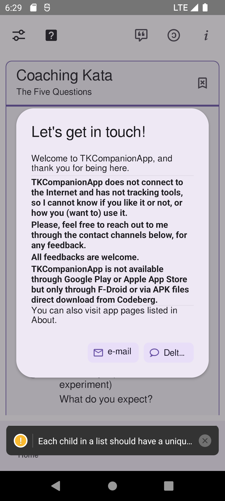
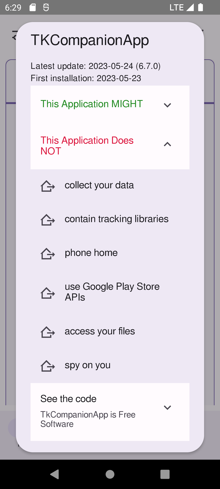

<!--
© 2021-2022 Marco Bresciani

Copying and distribution of this file, with or without modification,
are permitted in any medium without royalty provided the copyright
notice and this notice are preserved.
This file is offered as-is, without any warranty.

SPDX-FileCopyrightText: 2021-2022 Marco Bresciani

SPDX-License-Identifier: FSFAP
-->
# TKCompanionApp


[](https://api.reuse.software/info/github.com/marcoXbresciani/TKCompanionApp)

[](https://semver.org/)
[](https://github.com/RichardLitt/standard-readme)
[](https://confluence.atlassian.com/bitbucketserver/markdown-syntax-guide-776639995.html)
[](https://blog.codinghorror.com/the-works-on-my-machine-certification-program/)

Un piccolo e semplice aiuto per i praticanti di Toyota Kata

Contiene la carta Coaching Kata 5Q, e (forse) altre cose e informazioni.
Contenuti da migliorare e aggiornare di volta in volta.

## Sommario
1. [Contesto](#contesto)
1. [Installazione](#installazione)
1. [Uso](#uso)
   1. [Schermate](#schermate)
1. [Manutentori](#manutentori)
1. [Contribuire](#contribuire)
    1. [Come iniziare](#come-iniziare)
    1. [Come compilare](#come-compilare)
    1. [Come rilasciare](#come-rilasciare)
1. [Licenza](#licenza)

## Contesto
Dal sito web Toyota Kata:
> Toyota Kata is a way for managers and educators to initiate and coach
> practice of practical scientific-thinking skills in their teams, to
> develop and mobilize creative capability.
> Competitive conditions favor teams and organizations that know how to
> adapt.
> It's not as difficult as you might think, because you can begin by
> practicing a set of simple "Starter Kata."
>
> Toyota Kata is about starter practice routines for developing
> scientific thinking.
> From there each individual & team can develop their own way.
>
> Toyota Kata is a skill-building process that shifts you and your team
> from a natural tendency to jump to conclusions ... to thinking,
> working and reacting more scientifically.
> Best of all, you only need to practice 20 minutes a day, under the
> guidance of your coach.

## Installazione
Questa app è creata usando React Native, tramite il framework Expo, per
fare in modo che l'app per Android e iOS sia generata più facilmente
dallo stesso codice sorgente.

Purtroppo, pubblicare l'app su Google Play Store o su Apple App Store,
richiede soldi che non voglio spendere: è
[una tantum $25](https://support.google.com/googleplay/android-developer/answer/6112435?hl=it&ref_topic=3450769#zippy=%2Cstep-pay-registration-fee)
per un account sviluppatore Google, ed è pari a
[$99/anno](https://developer.apple.com/support/enrollment/) (!) per il
Programma per Sviluppatori Apple.

Quindi, per ora, questa app si troverà solo tramite su
[F-Droid](https://f-droid.org/), il _catalogo installabile di FOSS
(Software open source gratuito) per la piattaforma Android_.

Per installare questa app, è necessaria l'app client F-Droid (molto
simile a Google Play Store o Apple App Store) dal
[sito principale](https://www.f-droid.org/): c'è un QR Code facile da
usare per scaricarla e
[installarla](https://en.wikipedia.org/wiki/F-Droid#Client_application).

Quindi, aprendo l'app F-Droid si può cercare _TKCompanionApp_.
Installarla e aprirla.

Benvenuti nel mondo FOSS.
Si può dare anche un'occhiata a tutte le altre meravigliose app FOSS che
si trovano in F-Droid.

## Uso
Beh, è facile: installa l'app, apri l'app, fai clic su alcuni pulsanti.
Non ci sono giochi, nessun quiz, nessuna azione da intraprendere.
Siediti, segui il menu, impara, esercitati e migliora.

> **Nota**: l'icona
>  sui
> pulsanti, significa che l'app aprirà una pagina web al di fuori
> dell'app stessa, usando qualsiasi browser o app configurata sul
> telefono per navigare in Internet.

### Schermate




## Manutentori
L'app è stata iniziata da Marco Bresciani ed è attualmente mantenuta da
Marco Bresciani.
Lo stesso per questo documento.

## Contribuire
Se sei uno sviluppatore software e vuoi contribuire a migliorare l'app,
sei più che benvenuto!
Trova l'ultimo NodeJS LTS corrente
([16.13.2](https://nodejs.org/download/release/latest-gallium/), al
2022-01-19) per il tuo sistema.
Prendi il codice sorgente clonando
[il repository](https://github.com/marcoXbresciani/TKCompanionApp).
Quindi vai nella cartella principale del progetto (contenente anche
questo stesso file che stai leggendo) ed esegui `npm -g install yarn`.
Fatto questo, esegui `yarn install` e dovresti vedere che tutte le
dipendenze necessarie sono scaricate e installate tramite il gestore di
pacchetti Yarn.


Se non sei uno sviluppatore di software e vuoi contribuire a migliorare
questa app, sei altrettanto più che benvenuto!
Non ti serve il codice, ma se vuoi aiutare per tradurre nella tua lingua
(o correggere il mio inglese, dato che non sono madrelingua), aggiungere
altro contenuto, suggerire miglioramenti grafici o di layout o altro
contributo che puoi dare, per favore
[crea una nuova attività](https://github.com/marcoXbresciani/TKCompanionApp/issues)
spiegando il problema che hai notato e la soluzione proposta.

Siamo qui per migliorare!

### Come iniziare
Dalla riga di comando avvia `yarn start` (o `expo start --dev-client`,
ma perché peggiorare la tua vita?) che eseguirà lo strumento Metro (non
so cosa sia, in realtà, ma sembra necessario).

Da (un'altra) riga di comando avvia `yarn android` (o, ancora, rendi
peggiore la tua vita e usa `expo run:android`) che preparerà e avvierà
la tua app, connettendoti al Metro-coso di cui sopra.

È anche possibile eseguire semplicemente `yarn start` e quindi aprire un
emulatore Android (o iOS, per quello che vale) dagli strumenti di
sviluppo Metro che dovrebbe essere stato aperto nel tuo browser.

### Come compilare
Una volta avresti dovuto usare `expo build:android`, ma ora è stato
sostituito da `eas build`.
Quindi, installa `eas-cli` con il comando `npm install -g eas-cli` ed
esegui il seguente `eas build -p android` per (possibilmente) un po' di
divertimento.
Forse.

### Come rilasciare

## Licenza
Licenza generale del progetto, in breve:
[](https://www.gnu.org/licenses/gpl-3.0.html)
```text
© 2021-2022 Marco Bresciani
This file is part of TKCompanionApp.

TKCompanionApp is free software: you can redistribute it and/or modify
it under the terms of the GNU General Public License as published by the
Free Software Foundation, either version 3 of the License, or (at your
option) any later version.

TKCompanionApp is distributed in the hope that it will be useful, but
WITHOUT ANY WARRANTY; without even the implied warranty of
MERCHANTABILITY or FITNESS FOR A PARTICULAR PURPOSE. See the GNU General
Public License for more details.

You should have received a copy of the GNU General Public License along
with TKCompanionApp. If not, see <https://www.gnu.org/licenses/>.
```

Licenza di questo documento, in breve:
[](https://www.gnu.org/prep/maintain/html_node/License-Notices-for-Other-Files.html)
```text
© 2021-2022 Marco Bresciani

Copying and distribution of this file, with or without modification,
are permitted in any medium without royalty provided the copyright
notice and this notice are preserved.
This file is offered as-is, without any warranty.
```

> []()
> Questa è una opera liberamente licenziata, come spiegato nella
> [Definizione di Opere Culturali Libere](https://freedomdefined.org/Definition).

Il carattere usato è **Open Sans**: © 2021
[Steve Matteson](https://mattesontypographics.com/).

[These fonts are licensed under the Apache License, Version
2.0](https://fonts.google.com/specimen/Open+Sans#license).

Vedere la cartella `LICENSES` o il file `COPYING` per i testi integrali
delle licenze.
