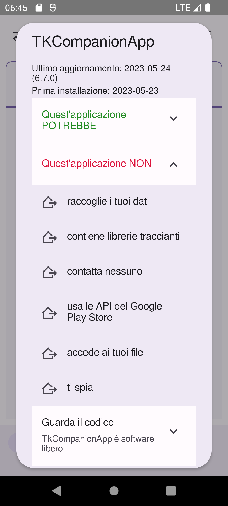
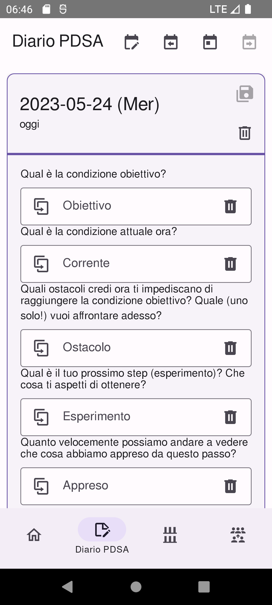
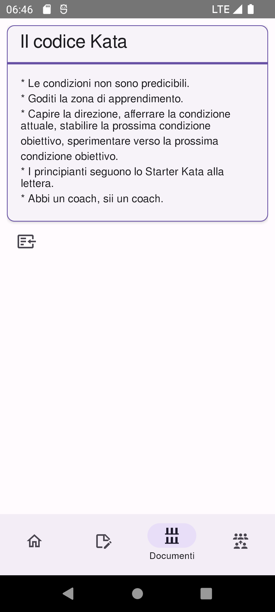

<!--
© 2021-2022 Marco Bresciani

Copying and distribution of this file, with or without modification,
are permitted in any medium without royalty provided the copyright
notice and this notice are preserved.
This file is offered as-is, without any warranty.

SPDX-FileCopyrightText: 2021-2022 Marco Bresciani

SPDX-License-Identifier: FSFAP
-->
# TKCompanionApp

[![Codeberg](data:image/svg+xml;base64,PHN2ZyB4bWxucz0iaHR0cDovL3d3dy53My5vcmcvMjAwMC9zdmciIHdpZHRoPSIxODQuNzUiIGhlaWdodD0iMzUiIHZpZXdCb3g9IjAgMCAxODQuNzUgMzUiPjxyZWN0IGNsYXNzPSJzdmdfX3JlY3QiIHg9IjAiIHk9IjAiIHdpZHRoPSI5MS43NiIgaGVpZ2h0PSIzNSIgZmlsbD0iIzAwMDAwMCIvPjxyZWN0IGNsYXNzPSJzdmdfX3JlY3QiIHg9Ijg5Ljc2IiB5PSIwIiB3aWR0aD0iOTQuOTkiIGhlaWdodD0iMzUiIGZpbGw9IiNFNDZDMTciLz48cGF0aCBjbGFzcz0ic3ZnX190ZXh0IiBkPSJNMTkuNTcgMjJMMTQuMjIgMjJMMTQuMjIgMTMuNDdMMTUuNzAgMTMuNDdMMTUuNzAgMjAuODJMMTkuNTcgMjAuODJMMTkuNTcgMjJaTTI1LjI2IDIyTDIzLjc5IDIyTDIzLjc5IDEzLjQ3TDI1LjI2IDEzLjQ3TDI1LjI2IDIyWk0yOS44MCAxOC4xOUwyOS44MCAxOC4xOUwyOS44MCAxNy4zOVEyOS44MCAxNi4xOSAzMC4yMyAxNS4yN1EzMC42NiAxNC4zNSAzMS40NiAxMy44NVEzMi4yNiAxMy4zNSAzMy4zMSAxMy4zNUwzMy4zMSAxMy4zNVEzNC43MiAxMy4zNSAzNS41OCAxNC4xMlEzNi40NCAxNC44OSAzNi41OCAxNi4yOUwzNi41OCAxNi4yOUwzNS4xMSAxNi4yOVEzNS4wMCAxNS4zNyAzNC41NyAxNC45NlEzNC4xNCAxNC41NSAzMy4zMSAxNC41NUwzMy4zMSAxNC41NVEzMi4zNCAxNC41NSAzMS44MiAxNS4yNlEzMS4zMCAxNS45NiAzMS4yOSAxNy4zM0wzMS4yOSAxNy4zM0wzMS4yOSAxOC4wOVEzMS4yOSAxOS40NyAzMS43OSAyMC4yMFEzMi4yOCAyMC45MiAzMy4yNCAyMC45MkwzMy4yNCAyMC45MlEzNC4xMSAyMC45MiAzNC41NSAyMC41M1EzNC45OSAyMC4xNCAzNS4xMSAxOS4yMkwzNS4xMSAxOS4yMkwzNi41OCAxOS4yMlEzNi40NSAyMC41OSAzNS41NyAyMS4zNVEzNC43MCAyMi4xMiAzMy4yNCAyMi4xMkwzMy4yNCAyMi4xMlEzMi4yMiAyMi4xMiAzMS40NCAyMS42M1EzMC42NiAyMS4xNSAzMC4yNCAyMC4yNlEyOS44MiAxOS4zNyAyOS44MCAxOC4xOVpNNDYuNDcgMjJMNDAuODkgMjJMNDAuODkgMTMuNDdMNDYuNDMgMTMuNDdMNDYuNDMgMTQuNjZMNDIuMzggMTQuNjZMNDIuMzggMTcuMDJMNDUuODggMTcuMDJMNDUuODggMTguMTlMNDIuMzggMTguMTlMNDIuMzggMjAuODJMNDYuNDcgMjAuODJMNDYuNDcgMjJaTTUyLjE1IDIyTDUwLjY3IDIyTDUwLjY3IDEzLjQ3TDUyLjE1IDEzLjQ3TDU1Ljk3IDE5LjU0TDU1Ljk3IDEzLjQ3TDU3LjQ0IDEzLjQ3TDU3LjQ0IDIyTDU1Ljk1IDIyTDUyLjE1IDE1Ljk1TDUyLjE1IDIyWk02MS43NCAxOS40Mkw2MS43NCAxOS40Mkw2My4yMyAxOS40MlE2My4yMyAyMC4xNSA2My43MSAyMC41NVE2NC4xOSAyMC45NSA2NS4wOCAyMC45NUw2NS4wOCAyMC45NVE2NS44NiAyMC45NSA2Ni4yNSAyMC42M1E2Ni42NCAyMC4zMiA2Ni42NCAxOS44MEw2Ni42NCAxOS44MFE2Ni42NCAxOS4yNCA2Ni4yNCAxOC45NFE2NS44NCAxOC42MyA2NC44MSAxOC4zMlE2My43OCAxOC4wMSA2My4xNyAxNy42M0w2My4xNyAxNy42M1E2Mi4wMSAxNi45MCA2Mi4wMSAxNS43Mkw2Mi4wMSAxNS43MlE2Mi4wMSAxNC42OSA2Mi44NSAxNC4wMlE2My42OSAxMy4zNSA2NS4wMyAxMy4zNUw2NS4wMyAxMy4zNVE2NS45MiAxMy4zNSA2Ni42MiAxMy42OFE2Ny4zMSAxNC4wMSA2Ny43MSAxNC42MVE2OC4xMSAxNS4yMiA2OC4xMSAxNS45Nkw2OC4xMSAxNS45Nkw2Ni42NCAxNS45NlE2Ni42NCAxNS4yOSA2Ni4yMiAxNC45MVE2NS44MCAxNC41NCA2NS4wMiAxNC41NEw2NS4wMiAxNC41NFE2NC4yOSAxNC41NCA2My44OSAxNC44NVE2My40OSAxNS4xNiA2My40OSAxNS43MUw2My40OSAxNS43MVE2My40OSAxNi4xOCA2My45MiAxNi41MFE2NC4zNiAxNi44MSA2NS4zNSAxNy4xMFE2Ni4zNSAxNy40MCA2Ni45NSAxNy43OFE2Ny41NiAxOC4xNiA2Ny44NCAxOC42NVE2OC4xMiAxOS4xMyA2OC4xMiAxOS43OUw2OC4xMiAxOS43OVE2OC4xMiAyMC44NiA2Ny4zMCAyMS40OVE2Ni40OCAyMi4xMiA2NS4wOCAyMi4xMkw2NS4wOCAyMi4xMlE2NC4xNiAyMi4xMiA2My4zOCAyMS43N1E2Mi42MCAyMS40MyA2Mi4xNyAyMC44M1E2MS43NCAyMC4yMiA2MS43NCAxOS40MlpNNzcuOTggMjJMNzIuNDEgMjJMNzIuNDEgMTMuNDdMNzcuOTQgMTMuNDdMNzcuOTQgMTQuNjZMNzMuODkgMTQuNjZMNzMuODkgMTcuMDJMNzcuMzkgMTcuMDJMNzcuMzkgMTguMTlMNzMuODkgMTguMTlMNzMuODkgMjAuODJMNzcuOTggMjAuODJMNzcuOTggMjJaIiBmaWxsPSIjRkZGRkZGIi8+PHBhdGggY2xhc3M9InN2Z19fdGV4dCIgZD0iTTEwMy41MiAxNy44MEwxMDMuNTIgMTcuODBRMTAzLjUyIDE2LjU0IDEwNC4xMiAxNS41NFExMDQuNzIgMTQuNTUgMTA1Ljc4IDEzLjk5UTEwNi44NSAxMy40MyAxMDguMjAgMTMuNDNMMTA4LjIwIDEzLjQzUTEwOS4zNyAxMy40MyAxMTAuMzEgMTMuODNRMTExLjI1IDE0LjIyIDExMS44NyAxNC45N0wxMTEuODcgMTQuOTdMMTEwLjM2IDE2LjMzUTEwOS41MSAxNS40MCAxMDguMzQgMTUuNDBMMTA4LjM0IDE1LjQwUTEwOC4zMiAxNS40MCAxMDguMzIgMTUuNDBMMTA4LjMyIDE1LjQwUTEwNy4yNCAxNS40MCAxMDYuNTggMTYuMDZRMTA1LjkyIDE2LjcxIDEwNS45MiAxNy44MEwxMDUuOTIgMTcuODBRMTA1LjkyIDE4LjUwIDEwNi4yMiAxOS4wNFExMDYuNTIgMTkuNTkgMTA3LjA2IDE5Ljg5UTEwNy42MCAyMC4yMCAxMDguMzAgMjAuMjBMMTA4LjMwIDIwLjIwUTEwOC45OCAyMC4yMCAxMDkuNTggMTkuOTNMMTA5LjU4IDE5LjkzTDEwOS41OCAxNy42MkwxMTEuNjggMTcuNjJMMTExLjY4IDIxLjEwUTExMC45NiAyMS42MSAxMTAuMDIgMjEuODlRMTA5LjA5IDIyLjE3IDEwOC4xNSAyMi4xN0wxMDguMTUgMjIuMTdRMTA2LjgzIDIyLjE3IDEwNS43NyAyMS42MVExMDQuNzIgMjEuMDUgMTA0LjEyIDIwLjA1UTEwMy41MiAxOS4wNiAxMDMuNTIgMTcuODBaTTExOS4wNSAyMkwxMTYuNjcgMjJMMTE2LjY3IDEzLjYwTDEyMC41MSAxMy42MFExMjEuNjUgMTMuNjAgMTIyLjQ5IDEzLjk4UTEyMy4zMyAxNC4zNSAxMjMuNzkgMTUuMDZRMTI0LjI0IDE1Ljc2IDEyNC4yNCAxNi43MUwxMjQuMjQgMTYuNzFRMTI0LjI0IDE3LjY2IDEyMy43OSAxOC4zNVExMjMuMzMgMTkuMDUgMTIyLjQ5IDE5LjQyUTEyMS42NSAxOS44MCAxMjAuNTEgMTkuODBMMTIwLjUxIDE5LjgwTDExOS4wNSAxOS44MEwxMTkuMDUgMjJaTTExOS4wNSAxNS40N0wxMTkuMDUgMTcuOTNMMTIwLjM3IDE3LjkzUTEyMS4xMCAxNy45MyAxMjEuNDcgMTcuNjFRMTIxLjg0IDE3LjI5IDEyMS44NCAxNi43MUwxMjEuODQgMTYuNzFRMTIxLjg0IDE2LjEyIDEyMS40NyAxNS44MFExMjEuMTAgMTUuNDcgMTIwLjM3IDE1LjQ3TDEyMC4zNyAxNS40N0wxMTkuMDUgMTUuNDdaTTEzNS4zOCAyMkwxMjkuMDAgMjJMMTI5LjAwIDEzLjYwTDEzMS4zOCAxMy42MEwxMzEuMzggMjAuMTFMMTM1LjM4IDIwLjExTDEzNS4zOCAyMlpNMTQzLjA0IDE5LjQ2TDEzOS41NCAxOS40NkwxMzkuNTQgMTcuNzFMMTQzLjA0IDE3LjcxTDE0My4wNCAxOS40NlpNMTQ3LjA2IDIxLjM0TDE0Ny4wNiAyMS4zNEwxNDcuOTIgMTkuNTVRMTQ4LjQxIDE5Ljg4IDE0OS4wMyAyMC4wN1ExNDkuNjUgMjAuMjUgMTUwLjI1IDIwLjI1TDE1MC4yNSAyMC4yNVExNTAuODYgMjAuMjUgMTUxLjIyIDIwLjAyUTE1MS41OCAxOS43OSAxNTEuNTggMTkuMzdMMTUxLjU4IDE5LjM3UTE1MS41OCAxOC41NSAxNTAuMzAgMTguNTVMMTUwLjMwIDE4LjU1TDE0OS4zMCAxOC41NUwxNDkuMzAgMTcuMDVMMTUwLjgwIDE1LjQ0TDE0Ny40OSAxNS40NEwxNDcuNDkgMTMuNjBMMTUzLjU2IDEzLjYwTDE1My41NiAxNS4wOUwxNTEuODIgMTYuOTZRMTUyLjg2IDE3LjE4IDE1My40MiAxNy44MlExNTMuOTggMTguNDYgMTUzLjk4IDE5LjM3TDE1My45OCAxOS4zN1ExNTMuOTggMjAuMTEgMTUzLjU4IDIwLjc1UTE1My4xNyAyMS4zOSAxNTIuMzUgMjEuNzhRMTUxLjUzIDIyLjE3IDE1MC4zMiAyMi4xN0wxNTAuMzIgMjIuMTdRMTQ5LjQzIDIyLjE3IDE0OC41NiAyMS45NVExNDcuNjkgMjEuNzQgMTQ3LjA2IDIxLjM0Wk0xNTguMTQgMjAuNzVMMTU4LjE0IDIwLjc1UTE1OC4xNCAyMC4xNSAxNTguNTMgMTkuNzhRMTU4LjkyIDE5LjQxIDE1OS41MSAxOS40MUwxNTkuNTEgMTkuNDFRMTYwLjExIDE5LjQxIDE2MC40OSAxOS43OFExNjAuODggMjAuMTUgMTYwLjg4IDIwLjc1TDE2MC44OCAyMC43NVExNjAuODggMjEuMzQgMTYwLjQ5IDIxLjcyUTE2MC4xMCAyMi4xMSAxNTkuNTEgMjIuMTFMMTU5LjUxIDIyLjExUTE1OC45MyAyMi4xMSAxNTguNTQgMjEuNzJRMTU4LjE0IDIxLjM0IDE1OC4xNCAyMC43NVpNMTY1LjExIDE3LjgwTDE2NS4xMSAxNy44MFExNjUuMTEgMTYuNDUgMTY1LjU4IDE1LjQ2UTE2Ni4wNSAxNC40NiAxNjYuODkgMTMuOTVRMTY3LjczIDEzLjQzIDE2OC44MSAxMy40M0wxNjguODEgMTMuNDNRMTY5Ljg4IDEzLjQzIDE3MC43MiAxMy45NVExNzEuNTYgMTQuNDYgMTcyLjAzIDE1LjQ2UTE3Mi41MSAxNi40NSAxNzIuNTEgMTcuODBMMTcyLjUxIDE3LjgwUTE3Mi41MSAxOS4xNSAxNzIuMDMgMjAuMTVRMTcxLjU2IDIxLjE0IDE3MC43MiAyMS42NVExNjkuODggMjIuMTcgMTY4LjgxIDIyLjE3TDE2OC44MSAyMi4xN1ExNjcuNzMgMjIuMTcgMTY2Ljg5IDIxLjY1UTE2Ni4wNSAyMS4xNCAxNjUuNTggMjAuMTVRMTY1LjExIDE5LjE2IDE2NS4xMSAxNy44MFpNMTY3LjQ5IDE3LjgwTDE2Ny40OSAxNy44MFExNjcuNDkgMTkuMDYgMTY3Ljg1IDE5LjY0UTE2OC4yMCAyMC4yMiAxNjguODEgMjAuMjJMMTY4LjgxIDIwLjIyUTE2OS40MSAyMC4yMiAxNjkuNzcgMTkuNjRRMTcwLjEyIDE5LjA2IDE3MC4xMiAxNy44MEwxNzAuMTIgMTcuODBRMTcwLjEyIDE2LjU0IDE2OS43NyAxNS45NlExNjkuNDEgMTUuMzggMTY4LjgxIDE1LjM4TDE2OC44MSAxNS4zOFExNjguMjAgMTUuMzggMTY3Ljg1IDE1Ljk2UTE2Ny40OSAxNi41NCAxNjcuNDkgMTcuODBaIiBmaWxsPSIjRkZGRkZGIiB4PSIxMDIuNzYiLz48L3N2Zz4=)](https://codeberg.org/marco.bresciani/TKCompanionApp/src/branch/master/COPYING)
[![Codeberg tag (latest SemVer)](data:image/svg+xml;base64,PHN2ZyB4bWxucz0iaHR0cDovL3d3dy53My5vcmcvMjAwMC9zdmciIHdpZHRoPSIxMzYuOTIiIGhlaWdodD0iMzUiIHZpZXdCb3g9IjAgMCAxMzYuOTIgMzUiPjxyZWN0IGNsYXNzPSJzdmdfX3JlY3QiIHg9IjAiIHk9IjAiIHdpZHRoPSI1Ni4wNCIgaGVpZ2h0PSIzNSIgZmlsbD0iI0E3QkZDMSIvPjxyZWN0IGNsYXNzPSJzdmdfX3JlY3QiIHg9IjU0LjA0IiB5PSIwIiB3aWR0aD0iODIuODgiIGhlaWdodD0iMzUiIGZpbGw9IiMwMDAwMDAiLz48cGF0aCBjbGFzcz0ic3ZnX190ZXh0IiBkPSJNMTYuMjUgMTQuNjZMMTMuNjEgMTQuNjZMMTMuNjEgMTMuNDdMMjAuMzggMTMuNDdMMjAuMzggMTQuNjZMMTcuNzIgMTQuNjZMMTcuNzIgMjJMMTYuMjUgMjJMMTYuMjUgMTQuNjZaTTI0LjkyIDIyTDIzLjM4IDIyTDI2LjYwIDEzLjQ3TDI3LjkzIDEzLjQ3TDMxLjE2IDIyTDI5LjYxIDIyTDI4LjkxIDIwLjAxTDI1LjYxIDIwLjAxTDI0LjkyIDIyWk0yNy4yNiAxNS4yOEwyNi4wMiAxOC44MkwyOC41MCAxOC44MkwyNy4yNiAxNS4yOFpNMzQuODcgMTguMTNMMzQuODcgMTguMTNMMzQuODcgMTcuNDZRMzQuODcgMTUuNTMgMzUuNzkgMTQuNDRRMzYuNzIgMTMuMzUgMzguMzggMTMuMzVMMzguMzggMTMuMzVRMzkuODAgMTMuMzUgNDAuNjQgMTQuMDVRNDEuNDggMTQuNzYgNDEuNjQgMTYuMDhMNDEuNjQgMTYuMDhMNDAuMTkgMTYuMDhRMzkuOTUgMTQuNTQgMzguNDAgMTQuNTRMMzguNDAgMTQuNTRRMzcuNDEgMTQuNTQgMzYuODkgMTUuMjZRMzYuMzcgMTUuOTggMzYuMzUgMTcuMzdMMzYuMzUgMTcuMzdMMzYuMzUgMTguMDJRMzYuMzUgMTkuNDAgMzYuOTQgMjAuMTdRMzcuNTIgMjAuOTMgMzguNTYgMjAuOTNMMzguNTYgMjAuOTNRMzkuNjkgMjAuOTMgNDAuMTcgMjAuNDJMNDAuMTcgMjAuNDJMNDAuMTcgMTguNzVMMzguNDIgMTguNzVMMzguNDIgMTcuNjJMNDEuNjUgMTcuNjJMNDEuNjUgMjAuODlRNDEuMTkgMjEuNTAgNDAuMzcgMjEuODFRMzkuNTUgMjIuMTIgMzguNTAgMjIuMTJMMzguNTAgMjIuMTJRMzcuNDMgMjIuMTIgMzYuNjEgMjEuNjNRMzUuNzggMjEuMTQgMzUuMzMgMjAuMjRRMzQuODggMTkuMzMgMzQuODcgMTguMTNaIiBmaWxsPSIjRkZGRkZGIi8+PHBhdGggY2xhc3M9InN2Z19fdGV4dCIgZD0iTTcwLjgxIDIyTDY3LjIyIDEzLjYwTDY5Ljc5IDEzLjYwTDcyLjA3IDE5LjA3TDc0LjQwIDEzLjYwTDc2Ljc1IDEzLjYwTDczLjE1IDIyTDcwLjgxIDIyWk04MC4xNiAyMS4zNEw4MC4xNiAyMS4zNEw4MS4wMSAxOS41NVE4MS41MiAxOS44OCA4Mi4xMiAyMC4wN1E4Mi43MyAyMC4yNSA4My4zNCAyMC4yNUw4My4zNCAyMC4yNVE4My45NSAyMC4yNSA4NC4zMSAyMC4wMVE4NC42OCAxOS43OCA4NC42OCAxOS4zNkw4NC42OCAxOS4zNlE4NC42OCAxOC45NCA4NC4zMiAxOC43MlE4My45NyAxOC41MSA4My4wNSAxOC41MUw4My4wNSAxOC41MUw4MC43NyAxOC41MUw4MS4xOSAxMy42MEw4Ni41NCAxMy42MEw4Ni41NCAxNS40NEw4My4xNiAxNS40NEw4My4wNSAxNi42Nkw4My42MSAxNi42NlE4NS4zOCAxNi42NiA4Ni4yMiAxNy4zOFE4Ny4wNyAxOC4xMCA4Ny4wNyAxOS4zMEw4Ny4wNyAxOS4zMFE4Ny4wNyAyMC4wOCA4Ni42NyAyMC43M1E4Ni4yNyAyMS4zOSA4NS40NSAyMS43OFE4NC42MiAyMi4xNyA4My40MSAyMi4xN0w4My40MSAyMi4xN1E4Mi41MiAyMi4xNyA4MS42NSAyMS45NVE4MC43OCAyMS43NCA4MC4xNiAyMS4zNFpNOTEuMTYgMjAuNzVMOTEuMTYgMjAuNzVROTEuMTYgMjAuMTUgOTEuNTUgMTkuNzhROTEuOTMgMTkuNDEgOTIuNTMgMTkuNDFMOTIuNTMgMTkuNDFROTMuMTIgMTkuNDEgOTMuNTEgMTkuNzhROTMuODkgMjAuMTUgOTMuODkgMjAuNzVMOTMuODkgMjAuNzVROTMuODkgMjEuMzQgOTMuNTAgMjEuNzJROTMuMTEgMjIuMTEgOTIuNTMgMjIuMTFMOTIuNTMgMjIuMTFROTEuOTUgMjIuMTEgOTEuNTUgMjEuNzJROTEuMTYgMjEuMzQgOTEuMTYgMjAuNzVaTTk4LjEyIDE3LjgwTDk4LjEyIDE3LjgwUTk4LjEyIDE2LjQ1IDk4LjU5IDE1LjQ2UTk5LjA3IDE0LjQ2IDk5LjkxIDEzLjk1UTEwMC43NSAxMy40MyAxMDEuODMgMTMuNDNMMTAxLjgzIDEzLjQzUTEwMi44OSAxMy40MyAxMDMuNzMgMTMuOTVRMTA0LjU3IDE0LjQ2IDEwNS4wNSAxNS40NlExMDUuNTIgMTYuNDUgMTA1LjUyIDE3LjgwTDEwNS41MiAxNy44MFExMDUuNTIgMTkuMTUgMTA1LjA1IDIwLjE1UTEwNC41NyAyMS4xNCAxMDMuNzQgMjEuNjVRMTAyLjkwIDIyLjE3IDEwMS44MyAyMi4xN0wxMDEuODMgMjIuMTdRMTAwLjc1IDIyLjE3IDk5LjkxIDIxLjY1UTk5LjA3IDIxLjE0IDk4LjU5IDIwLjE1UTk4LjEyIDE5LjE2IDk4LjEyIDE3LjgwWk0xMDAuNTEgMTcuODBMMTAwLjUxIDE3LjgwUTEwMC41MSAxOS4wNiAxMDAuODYgMTkuNjRRMTAxLjIyIDIwLjIyIDEwMS44MyAyMC4yMkwxMDEuODMgMjAuMjJRMTAyLjQzIDIwLjIyIDEwMi43OCAxOS42NFExMDMuMTQgMTkuMDYgMTAzLjE0IDE3LjgwTDEwMy4xNCAxNy44MFExMDMuMTQgMTYuNTQgMTAyLjc4IDE1Ljk2UTEwMi40MyAxNS4zOCAxMDEuODMgMTUuMzhMMTAxLjgzIDE1LjM4UTEwMS4yMiAxNS4zOCAxMDAuODYgMTUuOTZRMTAwLjUxIDE2LjU0IDEwMC41MSAxNy44MFpNMTA5Ljc0IDIwLjc1TDEwOS43NCAyMC43NVExMDkuNzQgMjAuMTUgMTEwLjEzIDE5Ljc4UTExMC41MSAxOS40MSAxMTEuMTEgMTkuNDFMMTExLjExIDE5LjQxUTExMS43MCAxOS40MSAxMTIuMDkgMTkuNzhRMTEyLjQ3IDIwLjE1IDExMi40NyAyMC43NUwxMTIuNDcgMjAuNzVRMTEyLjQ3IDIxLjM0IDExMi4wOCAyMS43MlExMTEuNjkgMjIuMTEgMTExLjExIDIyLjExTDExMS4xMSAyMi4xMVExMTAuNTMgMjIuMTEgMTEwLjEzIDIxLjcyUTEwOS43NCAyMS4zNCAxMDkuNzQgMjAuNzVaTTExNi43MCAxNy44MEwxMTYuNzAgMTcuODBRMTE2LjcwIDE2LjQ1IDExNy4xNyAxNS40NlExMTcuNjUgMTQuNDYgMTE4LjQ5IDEzLjk1UTExOS4zMyAxMy40MyAxMjAuNDEgMTMuNDNMMTIwLjQxIDEzLjQzUTEyMS40NyAxMy40MyAxMjIuMzEgMTMuOTVRMTIzLjE1IDE0LjQ2IDEyMy42MyAxNS40NlExMjQuMTAgMTYuNDUgMTI0LjEwIDE3LjgwTDEyNC4xMCAxNy44MFExMjQuMTAgMTkuMTUgMTIzLjYzIDIwLjE1UTEyMy4xNSAyMS4xNCAxMjIuMzIgMjEuNjVRMTIxLjQ4IDIyLjE3IDEyMC40MSAyMi4xN0wxMjAuNDEgMjIuMTdRMTE5LjMzIDIyLjE3IDExOC40OSAyMS42NVExMTcuNjUgMjEuMTQgMTE3LjE3IDIwLjE1UTExNi43MCAxOS4xNiAxMTYuNzAgMTcuODBaTTExOS4wOSAxNy44MEwxMTkuMDkgMTcuODBRMTE5LjA5IDE5LjA2IDExOS40NCAxOS42NFExMTkuODAgMjAuMjIgMTIwLjQxIDIwLjIyTDEyMC40MSAyMC4yMlExMjEuMDEgMjAuMjIgMTIxLjM2IDE5LjY0UTEyMS43MiAxOS4wNiAxMjEuNzIgMTcuODBMMTIxLjcyIDE3LjgwUTEyMS43MiAxNi41NCAxMjEuMzYgMTUuOTZRMTIxLjAxIDE1LjM4IDEyMC40MSAxNS4zOEwxMjAuNDEgMTUuMzhRMTE5LjgwIDE1LjM4IDExOS40NCAxNS45NlExMTkuMDkgMTYuNTQgMTE5LjA5IDE3LjgwWiIgZmlsbD0iI0ZGRkZGRiIgeD0iNjcuMDM5OTk5OTk5OTk5OTkiLz48L3N2Zz4=)](https://codeberg.org/marco.bresciani/TKCompanionApp/src/tag/5.0.0)


[![TS-Standard - TypeScript Standard Style Guide](data:image/svg+xml;base64,PHN2ZyB4bWxucz0iaHR0cDovL3d3dy53My5vcmcvMjAwMC9zdmciIHdpZHRoPSIyNzMuMTQiIGhlaWdodD0iMzUiIHZpZXdCb3g9IjAgMCAyNzMuMTQgMzUiPjxyZWN0IGNsYXNzPSJzdmdfX3JlY3QiIHg9IjAiIHk9IjAiIHdpZHRoPSIxMjIuMSIgaGVpZ2h0PSIzNSIgZmlsbD0iIzAwMDAwMCIvPjxyZWN0IGNsYXNzPSJzdmdfX3JlY3QiIHg9IjEyMC4xIiB5PSIwIiB3aWR0aD0iMTUzLjA0MDAwMDAwMDAwMDAyIiBoZWlnaHQ9IjM1IiBmaWxsPSIjMDA1Mzg0Ii8+PHBhdGggY2xhc3M9InN2Z19fdGV4dCIgZD0iTTEzLjk1IDE4LjE5TDEzLjk1IDE4LjE5TDEzLjk1IDE3LjM5UTEzLjk1IDE2LjE5IDE0LjM4IDE1LjI3UTE0LjgwIDE0LjM1IDE1LjYwIDEzLjg1UTE2LjQwIDEzLjM1IDE3LjQ1IDEzLjM1TDE3LjQ1IDEzLjM1UTE4Ljg2IDEzLjM1IDE5LjczIDE0LjEyUTIwLjU5IDE0Ljg5IDIwLjczIDE2LjI5TDIwLjczIDE2LjI5TDE5LjI1IDE2LjI5UTE5LjE0IDE1LjM3IDE4LjcxIDE0Ljk2UTE4LjI4IDE0LjU1IDE3LjQ1IDE0LjU1TDE3LjQ1IDE0LjU1UTE2LjQ4IDE0LjU1IDE1Ljk3IDE1LjI2UTE1LjQ1IDE1Ljk2IDE1LjQ0IDE3LjMzTDE1LjQ0IDE3LjMzTDE1LjQ0IDE4LjA5UTE1LjQ0IDE5LjQ3IDE1LjkzIDIwLjIwUTE2LjQzIDIwLjkyIDE3LjM4IDIwLjkyTDE3LjM4IDIwLjkyUTE4LjI1IDIwLjkyIDE4LjY5IDIwLjUzUTE5LjEzIDIwLjE0IDE5LjI1IDE5LjIyTDE5LjI1IDE5LjIyTDIwLjczIDE5LjIyUTIwLjYwIDIwLjU5IDE5LjcyIDIxLjM1UTE4Ljg0IDIyLjEyIDE3LjM4IDIyLjEyTDE3LjM4IDIyLjEyUTE2LjM2IDIyLjEyIDE1LjU5IDIxLjYzUTE0LjgxIDIxLjE1IDE0LjM5IDIwLjI2UTEzLjk3IDE5LjM3IDEzLjk1IDE4LjE5Wk0yNC43NyAxOC4wMEwyNC43NyAxOC4wMEwyNC43NyAxNy41MlEyNC43NyAxNi4yOCAyNS4yMSAxNS4zMlEyNS42NSAxNC4zNyAyNi40NiAxMy44NlEyNy4yNyAxMy4zNSAyOC4zMSAxMy4zNVEyOS4zNSAxMy4zNSAzMC4xNiAxMy44NVEzMC45NiAxNC4zNSAzMS40MCAxNS4yOVEzMS44NCAxNi4yMyAzMS44NSAxNy40OEwzMS44NSAxNy40OEwzMS44NSAxNy45NlEzMS44NSAxOS4yMSAzMS40MSAyMC4xNlEzMC45OCAyMS4xMCAzMC4xOCAyMS42MVEyOS4zNyAyMi4xMiAyOC4zMiAyMi4xMkwyOC4zMiAyMi4xMlEyNy4yOCAyMi4xMiAyNi40NyAyMS42MVEyNS42NiAyMS4xMCAyNS4yMiAyMC4xN1EyNC43OCAxOS4yMyAyNC43NyAxOC4wMFpNMjYuMjUgMTcuNDZMMjYuMjUgMTcuOTZRMjYuMjUgMTkuMzYgMjYuODAgMjAuMTNRMjcuMzUgMjAuOTAgMjguMzIgMjAuOTBMMjguMzIgMjAuOTBRMjkuMzEgMjAuOTAgMjkuODQgMjAuMTVRMzAuMzcgMTkuNDAgMzAuMzcgMTcuOTZMMzAuMzcgMTcuOTZMMzAuMzcgMTcuNTFRMzAuMzcgMTYuMDkgMjkuODMgMTUuMzRRMjkuMjkgMTQuNTggMjguMzEgMTQuNThMMjguMzEgMTQuNThRMjcuMzUgMTQuNTggMjYuODEgMTUuMzNRMjYuMjYgMTYuMDkgMjYuMjUgMTcuNDZMMjYuMjUgMTcuNDZaTTM4Ljc3IDIyTDM2LjMxIDIyTDM2LjMxIDEzLjQ3TDM4LjgzIDEzLjQ3UTM5Ljk2IDEzLjQ3IDQwLjg0IDEzLjk3UTQxLjcyIDE0LjQ4IDQyLjIwIDE1LjQwUTQyLjY4IDE2LjMzIDQyLjY4IDE3LjUyTDQyLjY4IDE3LjUyTDQyLjY4IDE3Ljk1UTQyLjY4IDE5LjE2IDQyLjE5IDIwLjA4UTQxLjcxIDIxLjAwIDQwLjgyIDIxLjUwUTM5LjkyIDIyIDM4Ljc3IDIyTDM4Ljc3IDIyWk0zNy44MCAxNC42NkwzNy44MCAyMC44MkwzOC43NiAyMC44MlEzOS45MyAyMC44MiA0MC41NSAyMC4wOVE0MS4xOCAxOS4zNiA0MS4xOSAxNy45OUw0MS4xOSAxNy45OUw0MS4xOSAxNy41MlE0MS4xOSAxNi4xMyA0MC41OCAxNS40MFEzOS45OCAxNC42NiAzOC44MyAxNC42NkwzOC44MyAxNC42NkwzNy44MCAxNC42NlpNNTIuNzIgMjJMNDcuMTQgMjJMNDcuMTQgMTMuNDdMNTIuNjggMTMuNDdMNTIuNjggMTQuNjZMNDguNjIgMTQuNjZMNDguNjIgMTcuMDJMNTIuMTMgMTcuMDJMNTIuMTMgMTguMTlMNDguNjIgMTguMTlMNDguNjIgMjAuODJMNTIuNzIgMjAuODJMNTIuNzIgMjJaTTYyLjQ2IDE5LjQyTDYyLjQ2IDE5LjQyTDYzLjk0IDE5LjQyUTYzLjk0IDIwLjE1IDY0LjQyIDIwLjU1UTY0LjkwIDIwLjk1IDY1LjgwIDIwLjk1TDY1LjgwIDIwLjk1UTY2LjU3IDIwLjk1IDY2Ljk2IDIwLjYzUTY3LjM1IDIwLjMyIDY3LjM1IDE5LjgwTDY3LjM1IDE5LjgwUTY3LjM1IDE5LjI0IDY2Ljk1IDE4Ljk0UTY2LjU2IDE4LjYzIDY1LjUzIDE4LjMyUTY0LjUwIDE4LjAxIDYzLjg5IDE3LjYzTDYzLjg5IDE3LjYzUTYyLjcyIDE2LjkwIDYyLjcyIDE1LjcyTDYyLjcyIDE1LjcyUTYyLjcyIDE0LjY5IDYzLjU2IDE0LjAyUTY0LjQwIDEzLjM1IDY1Ljc0IDEzLjM1TDY1Ljc0IDEzLjM1UTY2LjY0IDEzLjM1IDY3LjMzIDEzLjY4UTY4LjAzIDE0LjAxIDY4LjQzIDE0LjYxUTY4LjgzIDE1LjIyIDY4LjgzIDE1Ljk2TDY4LjgzIDE1Ljk2TDY3LjM1IDE1Ljk2UTY3LjM1IDE1LjI5IDY2LjkzIDE0LjkxUTY2LjUxIDE0LjU0IDY1LjczIDE0LjU0TDY1LjczIDE0LjU0UTY1LjAxIDE0LjU0IDY0LjYwIDE0Ljg1UTY0LjIwIDE1LjE2IDY0LjIwIDE1LjcxTDY0LjIwIDE1LjcxUTY0LjIwIDE2LjE4IDY0LjY0IDE2LjUwUTY1LjA3IDE2LjgxIDY2LjA3IDE3LjEwUTY3LjA2IDE3LjQwIDY3LjY3IDE3Ljc4UTY4LjI3IDE4LjE2IDY4LjU1IDE4LjY1UTY4LjgzIDE5LjEzIDY4LjgzIDE5Ljc5TDY4LjgzIDE5Ljc5UTY4LjgzIDIwLjg2IDY4LjAyIDIxLjQ5UTY3LjIwIDIyLjEyIDY1LjgwIDIyLjEyTDY1LjgwIDIyLjEyUTY0Ljg3IDIyLjEyIDY0LjEwIDIxLjc3UTYzLjMyIDIxLjQzIDYyLjg5IDIwLjgzUTYyLjQ2IDIwLjIyIDYyLjQ2IDE5LjQyWk03NC44MCAxNC42Nkw3Mi4xNyAxNC42Nkw3Mi4xNyAxMy40N0w3OC45MyAxMy40N0w3OC45MyAxNC42Nkw3Ni4yNyAxNC42Nkw3Ni4yNyAyMkw3NC44MCAyMkw3NC44MCAxNC42NlpNODQuNzMgMTguODZMODEuODYgMTMuNDdMODMuNTEgMTMuNDdMODUuNDcgMTcuNTFMODcuNDQgMTMuNDdMODkuMDggMTMuNDdMODYuMjIgMTguODZMODYuMjIgMjJMODQuNzMgMjJMODQuNzMgMTguODZaTTk4LjM1IDIyTDkyLjk5IDIyTDkyLjk5IDEzLjQ3TDk0LjQ3IDEzLjQ3TDk0LjQ3IDIwLjgyTDk4LjM1IDIwLjgyTDk4LjM1IDIyWk0xMDguMDUgMjJMMTAyLjQ3IDIyTDEwMi40NyAxMy40N0wxMDguMDEgMTMuNDdMMTA4LjAxIDE0LjY2TDEwMy45NSAxNC42NkwxMDMuOTUgMTcuMDJMMTA3LjQ2IDE3LjAyTDEwNy40NiAxOC4xOUwxMDMuOTUgMTguMTlMMTAzLjk1IDIwLjgyTDEwOC4wNSAyMC44MkwxMDguMDUgMjJaIiBmaWxsPSIjRkZGRkZGIi8+PHBhdGggY2xhc3M9InN2Z19fdGV4dCIgZD0iTTEzNi4wOCAxNS40OEwxMzMuNTAgMTUuNDhMMTMzLjUwIDEzLjYwTDE0MS4wMiAxMy42MEwxNDEuMDIgMTUuNDhMMTM4LjQ1IDE1LjQ4TDEzOC40NSAyMkwxMzYuMDggMjJMMTM2LjA4IDE1LjQ4Wk0xNDQuODEgMjEuMjRMMTQ0LjgxIDIxLjI0TDE0NS41OCAxOS40OVExNDYuMTUgMTkuODYgMTQ2Ljg5IDIwLjA5UTE0Ny42NCAyMC4zMiAxNDguMzYgMjAuMzJMMTQ4LjM2IDIwLjMyUTE0OS43MiAyMC4zMiAxNDkuNzMgMTkuNjRMMTQ5LjczIDE5LjY0UTE0OS43MyAxOS4yOCAxNDkuMzQgMTkuMTFRMTQ4Ljk1IDE4LjkzIDE0OC4wOCAxOC43NEwxNDguMDggMTguNzRRMTQ3LjEzIDE4LjUzIDE0Ni41MCAxOC4zMFExNDUuODYgMTguMDYgMTQ1LjQxIDE3LjU1UTE0NC45NSAxNy4wMyAxNDQuOTUgMTYuMTZMMTQ0Ljk1IDE2LjE2UTE0NC45NSAxNS4zOSAxNDUuMzcgMTQuNzdRMTQ1Ljc5IDE0LjE1IDE0Ni42MiAxMy43OVExNDcuNDYgMTMuNDMgMTQ4LjY3IDEzLjQzTDE0OC42NyAxMy40M1ExNDkuNDkgMTMuNDMgMTUwLjMwIDEzLjYyUTE1MS4xMCAxMy44MCAxNTEuNzIgMTQuMTdMMTUxLjcyIDE0LjE3TDE1MC45OSAxNS45M1ExNDkuNzkgMTUuMjggMTQ4LjY2IDE1LjI4TDE0OC42NiAxNS4yOFExNDcuOTUgMTUuMjggMTQ3LjYyIDE1LjQ5UTE0Ny4zMCAxNS43MCAxNDcuMzAgMTYuMDRMMTQ3LjMwIDE2LjA0UTE0Ny4zMCAxNi4zNyAxNDcuNjkgMTYuNTRRMTQ4LjA3IDE2LjcxIDE0OC45MiAxNi44OUwxNDguOTIgMTYuODlRMTQ5Ljg4IDE3LjEwIDE1MC41MSAxNy4zM1ExNTEuMTQgMTcuNTYgMTUxLjYwIDE4LjA3UTE1Mi4wNyAxOC41OCAxNTIuMDcgMTkuNDZMMTUyLjA3IDE5LjQ2UTE1Mi4wNyAyMC4yMSAxNTEuNjUgMjAuODNRMTUxLjIzIDIxLjQ0IDE1MC4zOSAyMS44MFExNDkuNTUgMjIuMTcgMTQ4LjM0IDIyLjE3TDE0OC4zNCAyMi4xN1ExNDcuMzIgMjIuMTcgMTQ2LjM2IDIxLjkyUTE0NS40MCAyMS42NyAxNDQuODEgMjEuMjRaTTE1OS44OCAxOS40NkwxNTYuMzggMTkuNDZMMTU2LjM4IDE3LjcxTDE1OS44OCAxNy43MUwxNTkuODggMTkuNDZaTTE2NC4xOSAyMS4yNEwxNjQuMTkgMjEuMjRMMTY0Ljk3IDE5LjQ5UTE2NS41NCAxOS44NiAxNjYuMjggMjAuMDlRMTY3LjAyIDIwLjMyIDE2Ny43NCAyMC4zMkwxNjcuNzQgMjAuMzJRMTY5LjExIDIwLjMyIDE2OS4xMiAxOS42NEwxNjkuMTIgMTkuNjRRMTY5LjEyIDE5LjI4IDE2OC43MyAxOS4xMVExNjguMzQgMTguOTMgMTY3LjQ3IDE4Ljc0TDE2Ny40NyAxOC43NFExNjYuNTIgMTguNTMgMTY1Ljg4IDE4LjMwUTE2NS4yNSAxOC4wNiAxNjQuNzkgMTcuNTVRMTY0LjM0IDE3LjAzIDE2NC4zNCAxNi4xNkwxNjQuMzQgMTYuMTZRMTY0LjM0IDE1LjM5IDE2NC43NiAxNC43N1ExNjUuMTggMTQuMTUgMTY2LjAxIDEzLjc5UTE2Ni44NSAxMy40MyAxNjguMDYgMTMuNDNMMTY4LjA2IDEzLjQzUTE2OC44OCAxMy40MyAxNjkuNjkgMTMuNjJRMTcwLjQ5IDEzLjgwIDE3MS4xMSAxNC4xN0wxNzEuMTEgMTQuMTdMMTcwLjM4IDE1LjkzUTE2OS4xNyAxNS4yOCAxNjguMDQgMTUuMjhMMTY4LjA0IDE1LjI4UTE2Ny4zMyAxNS4yOCAxNjcuMDEgMTUuNDlRMTY2LjY5IDE1LjcwIDE2Ni42OSAxNi4wNEwxNjYuNjkgMTYuMDRRMTY2LjY5IDE2LjM3IDE2Ny4wNyAxNi41NFExNjcuNDYgMTYuNzEgMTY4LjMxIDE2Ljg5TDE2OC4zMSAxNi44OVExNjkuMjcgMTcuMTAgMTY5LjkwIDE3LjMzUTE3MC41MyAxNy41NiAxNzAuOTkgMTguMDdRMTcxLjQ1IDE4LjU4IDE3MS40NSAxOS40NkwxNzEuNDUgMTkuNDZRMTcxLjQ1IDIwLjIxIDE3MS4wMyAyMC44M1ExNzAuNjIgMjEuNDQgMTY5Ljc4IDIxLjgwUTE2OC45MyAyMi4xNyAxNjcuNzMgMjIuMTdMMTY3LjczIDIyLjE3UTE2Ni43MSAyMi4xNyAxNjUuNzUgMjEuOTJRMTY0Ljc5IDIxLjY3IDE2NC4xOSAyMS4yNFpNMTc3LjgyIDE1LjQ4TDE3NS4yNCAxNS40OEwxNzUuMjQgMTMuNjBMMTgyLjc2IDEzLjYwTDE4Mi43NiAxNS40OEwxODAuMjAgMTUuNDhMMTgwLjIwIDIyTDE3Ny44MiAyMkwxNzcuODIgMTUuNDhaTTE4OC41NSAyMkwxODYuMTMgMjJMMTg5LjgzIDEzLjYwTDE5Mi4xOCAxMy42MEwxOTUuODkgMjJMMTkzLjQzIDIyTDE5Mi43NiAyMC4zN0wxODkuMjEgMjAuMzdMMTg4LjU1IDIyWk0xOTAuOTkgMTUuOTNMMTg5LjkxIDE4LjYxTDE5Mi4wNyAxOC42MUwxOTAuOTkgMTUuOTNaTTIwMi4zOCAyMkwyMDAuMDUgMjJMMjAwLjA1IDEzLjYwTDIwMi4wMCAxMy42MEwyMDUuNzEgMTguMDdMMjA1LjcxIDEzLjYwTDIwOC4wNCAxMy42MEwyMDguMDQgMjJMMjA2LjA5IDIyTDIwMi4zOCAxNy41MkwyMDIuMzggMjJaTTIxNy4xNyAyMkwyMTMuMjAgMjJMMjEzLjIwIDEzLjYwTDIxNy4xNyAxMy42MFEyMTguNTYgMTMuNjAgMjE5LjYyIDE0LjEyUTIyMC42OSAxNC42MyAyMjEuMjggMTUuNThRMjIxLjg3IDE2LjUzIDIyMS44NyAxNy44MEwyMjEuODcgMTcuODBRMjIxLjg3IDE5LjA3IDIyMS4yOCAyMC4wMlEyMjAuNjkgMjAuOTcgMjE5LjYyIDIxLjQ4UTIxOC41NiAyMiAyMTcuMTcgMjJMMjE3LjE3IDIyWk0yMTUuNTggMTUuNTBMMjE1LjU4IDIwLjEwTDIxNy4wOCAyMC4xMFEyMTguMTYgMjAuMTAgMjE4LjgxIDE5LjQ5UTIxOS40NyAxOC44OCAyMTkuNDcgMTcuODBMMjE5LjQ3IDE3LjgwUTIxOS40NyAxNi43MiAyMTguODEgMTYuMTFRMjE4LjE2IDE1LjUwIDIxNy4wOCAxNS41MEwyMTcuMDggMTUuNTBMMjE1LjU4IDE1LjUwWk0yMjguMDEgMjJMMjI1LjU5IDIyTDIyOS4zMCAxMy42MEwyMzEuNjQgMTMuNjBMMjM1LjM2IDIyTDIzMi44OSAyMkwyMzIuMjMgMjAuMzdMMjI4LjY4IDIwLjM3TDIyOC4wMSAyMlpNMjMwLjQ1IDE1LjkzTDIyOS4zNyAxOC42MUwyMzEuNTMgMTguNjFMMjMwLjQ1IDE1LjkzWk0yNDEuODkgMjJMMjM5LjUxIDIyTDIzOS41MSAxMy42MEwyNDMuMzUgMTMuNjBRMjQ0LjUwIDEzLjYwIDI0NS4zMyAxMy45OFEyNDYuMTcgMTQuMzUgMjQ2LjYzIDE1LjA2UTI0Ny4wOSAxNS43NiAyNDcuMDkgMTYuNzFMMjQ3LjA5IDE2LjcxUTI0Ny4wOSAxNy42MiAyNDYuNjYgMTguMzBRMjQ2LjIzIDE4Ljk4IDI0NS40NCAxOS4zNkwyNDUuNDQgMTkuMzZMMjQ3LjI1IDIyTDI0NC43MSAyMkwyNDMuMTggMTkuNzdMMjQxLjg5IDE5Ljc3TDI0MS44OSAyMlpNMjQxLjg5IDE1LjQ3TDI0MS44OSAxNy45M0wyNDMuMjEgMTcuOTNRMjQzLjk0IDE3LjkzIDI0NC4zMSAxNy42MVEyNDQuNjggMTcuMjkgMjQ0LjY4IDE2LjcxTDI0NC42OCAxNi43MVEyNDQuNjggMTYuMTIgMjQ0LjMxIDE1Ljc5UTI0My45NCAxNS40NyAyNDMuMjEgMTUuNDdMMjQzLjIxIDE1LjQ3TDI0MS44OSAxNS40N1pNMjU1Ljg1IDIyTDI1MS44NyAyMkwyNTEuODcgMTMuNjBMMjU1Ljg1IDEzLjYwUTI1Ny4yMyAxMy42MCAyNTguMzAgMTQuMTJRMjU5LjM2IDE0LjYzIDI1OS45NSAxNS41OFEyNjAuNTQgMTYuNTMgMjYwLjU0IDE3LjgwTDI2MC41NCAxNy44MFEyNjAuNTQgMTkuMDcgMjU5Ljk1IDIwLjAyUTI1OS4zNiAyMC45NyAyNTguMzAgMjEuNDhRMjU3LjIzIDIyIDI1NS44NSAyMkwyNTUuODUgMjJaTTI1NC4yNSAxNS41MEwyNTQuMjUgMjAuMTBMMjU1Ljc1IDIwLjEwUTI1Ni44MyAyMC4xMCAyNTcuNDggMTkuNDlRMjU4LjE0IDE4Ljg4IDI1OC4xNCAxNy44MEwyNTguMTQgMTcuODBRMjU4LjE0IDE2LjcyIDI1Ny40OCAxNi4xMVEyNTYuODMgMTUuNTAgMjU1Ljc1IDE1LjUwTDI1NS43NSAxNS41MEwyNTQuMjUgMTUuNTBaIiBmaWxsPSIjRkZGRkZGIiB4PSIxMzMuMSIvPjwvc3ZnPg==)](https://github.com/standard/ts-standard)
[](https://api.reuse.software/info/github.com/marcoXbresciani/TKCompanionApp)
[![standard-readme compliant](data:image/svg+xml;base64,PHN2ZyB4bWxucz0iaHR0cDovL3d3dy53My5vcmcvMjAwMC9zdmciIHdpZHRoPSIyNjQuNzk5OTk5OTk5OTk5OTUiIGhlaWdodD0iMzUiIHZpZXdCb3g9IjAgMCAyNjQuNzk5OTk5OTk5OTk5OTUgMzUiPjxyZWN0IGNsYXNzPSJzdmdfX3JlY3QiIHg9IjAiIHk9IjAiIHdpZHRoPSIxNDQuNDUiIGhlaWdodD0iMzUiIGZpbGw9IiMwMDAwMDAiLz48cmVjdCBjbGFzcz0ic3ZnX19yZWN0IiB4PSIxNDIuNDUiIHk9IjAiIHdpZHRoPSIxMjIuMzUiIGhlaWdodD0iMzUiIGZpbGw9IiM4RkM5NjUiLz48cGF0aCBjbGFzcz0ic3ZnX190ZXh0IiBkPSJNMTUuNzAgMjJMMTQuMjIgMjJMMTQuMjIgMTMuNDdMMTcuMjIgMTMuNDdRMTguNjkgMTMuNDcgMTkuNTAgMTQuMTNRMjAuMzAgMTQuNzkgMjAuMzAgMTYuMDVMMjAuMzAgMTYuMDVRMjAuMzAgMTYuOTAgMTkuODkgMTcuNDhRMTkuNDcgMTguMDYgMTguNzMgMTguMzdMMTguNzMgMTguMzdMMjAuNjUgMjEuOTJMMjAuNjUgMjJMMTkuMDYgMjJMMTcuMzUgMTguNzFMMTUuNzAgMTguNzFMMTUuNzAgMjJaTTE1LjcwIDE0LjY2TDE1LjcwIDE3LjUyTDE3LjIyIDE3LjUyUTE3Ljk3IDE3LjUyIDE4LjM5IDE3LjE1UTE4LjgyIDE2Ljc3IDE4LjgyIDE2LjExTDE4LjgyIDE2LjExUTE4LjgyIDE1LjQzIDE4LjQzIDE1LjA1UTE4LjA0IDE0LjY4IDE3LjI2IDE0LjY2TDE3LjI2IDE0LjY2TDE1LjcwIDE0LjY2Wk0zMC4yNyAyMkwyNC42OSAyMkwyNC42OSAxMy40N0wzMC4yMyAxMy40N0wzMC4yMyAxNC42NkwyNi4xOCAxNC42NkwyNi4xOCAxNy4wMkwyOS42OCAxNy4wMkwyOS42OCAxOC4xOUwyNi4xOCAxOC4xOUwyNi4xOCAyMC44MkwzMC4yNyAyMC44MkwzMC4yNyAyMlpNMzUuMjUgMjJMMzMuNzEgMjJMMzYuOTMgMTMuNDdMMzguMjYgMTMuNDdMNDEuNDkgMjJMMzkuOTQgMjJMMzkuMjQgMjAuMDFMMzUuOTQgMjAuMDFMMzUuMjUgMjJaTTM3LjU5IDE1LjI4TDM2LjM1IDE4LjgyTDM4LjgzIDE4LjgyTDM3LjU5IDE1LjI4Wk00Ny45MCAyMkw0NS40NCAyMkw0NS40NCAxMy40N0w0Ny45NiAxMy40N1E0OS4wOSAxMy40NyA0OS45NyAxMy45N1E1MC44NCAxNC40OCA1MS4zMiAxNS40MFE1MS44MSAxNi4zMyA1MS44MSAxNy41Mkw1MS44MSAxNy41Mkw1MS44MSAxNy45NVE1MS44MSAxOS4xNiA1MS4zMiAyMC4wOFE1MC44NCAyMS4wMCA0OS45NCAyMS41MFE0OS4wNSAyMiA0Ny45MCAyMkw0Ny45MCAyMlpNNDYuOTIgMTQuNjZMNDYuOTIgMjAuODJMNDcuODkgMjAuODJRNDkuMDYgMjAuODIgNDkuNjggMjAuMDlRNTAuMzEgMTkuMzYgNTAuMzIgMTcuOTlMNTAuMzIgMTcuOTlMNTAuMzIgMTcuNTJRNTAuMzIgMTYuMTMgNDkuNzEgMTUuNDBRNDkuMTEgMTQuNjYgNDcuOTYgMTQuNjZMNDcuOTYgMTQuNjZMNDYuOTIgMTQuNjZaTTU3Ljc1IDIyTDU2LjI3IDIyTDU2LjI3IDEzLjQ3TDU4LjE5IDEzLjQ3TDYwLjY1IDIwLjAxTDYzLjExIDEzLjQ3TDY1LjAyIDEzLjQ3TDY1LjAyIDIyTDYzLjU1IDIyTDYzLjU1IDE5LjE5TDYzLjY5IDE1LjQzTDYxLjE3IDIyTDYwLjExIDIyTDU3LjYwIDE1LjQzTDU3Ljc1IDE5LjE5TDU3Ljc1IDIyWk03NS4zNCAyMkw2OS43NiAyMkw2OS43NiAxMy40N0w3NS4zMCAxMy40N0w3NS4zMCAxNC42Nkw3MS4yNSAxNC42Nkw3MS4yNSAxNy4wMkw3NC43NSAxNy4wMkw3NC43NSAxOC4xOUw3MS4yNSAxOC4xOUw3MS4yNSAyMC44Mkw3NS4zNCAyMC44Mkw3NS4zNCAyMlpNODUuMDggMTkuNDJMODUuMDggMTkuNDJMODYuNTYgMTkuNDJRODYuNTYgMjAuMTUgODcuMDQgMjAuNTVRODcuNTIgMjAuOTUgODguNDIgMjAuOTVMODguNDIgMjAuOTVRODkuMTkgMjAuOTUgODkuNTggMjAuNjNRODkuOTcgMjAuMzIgODkuOTcgMTkuODBMODkuOTcgMTkuODBRODkuOTcgMTkuMjQgODkuNTggMTguOTRRODkuMTggMTguNjMgODguMTUgMTguMzJRODcuMTIgMTguMDEgODYuNTEgMTcuNjNMODYuNTEgMTcuNjNRODUuMzQgMTYuOTAgODUuMzQgMTUuNzJMODUuMzQgMTUuNzJRODUuMzQgMTQuNjkgODYuMTggMTQuMDJRODcuMDMgMTMuMzUgODguMzcgMTMuMzVMODguMzcgMTMuMzVRODkuMjYgMTMuMzUgODkuOTYgMTMuNjhROTAuNjUgMTQuMDEgOTEuMDUgMTQuNjFROTEuNDUgMTUuMjIgOTEuNDUgMTUuOTZMOTEuNDUgMTUuOTZMODkuOTcgMTUuOTZRODkuOTcgMTUuMjkgODkuNTUgMTQuOTFRODkuMTQgMTQuNTQgODguMzYgMTQuNTRMODguMzYgMTQuNTRRODcuNjMgMTQuNTQgODcuMjMgMTQuODVRODYuODMgMTUuMTYgODYuODMgMTUuNzFMODYuODMgMTUuNzFRODYuODMgMTYuMTggODcuMjYgMTYuNTBRODcuNjkgMTYuODEgODguNjkgMTcuMTBRODkuNjkgMTcuNDAgOTAuMjkgMTcuNzhROTAuODkgMTguMTYgOTEuMTcgMTguNjVROTEuNDYgMTkuMTMgOTEuNDYgMTkuNzlMOTEuNDYgMTkuNzlROTEuNDYgMjAuODYgOTAuNjQgMjEuNDlRODkuODIgMjIuMTIgODguNDIgMjIuMTJMODguNDIgMjIuMTJRODcuNDkgMjIuMTIgODYuNzIgMjEuNzdRODUuOTQgMjEuNDMgODUuNTEgMjAuODNRODUuMDggMjAuMjIgODUuMDggMTkuNDJaTTk3LjQzIDE0LjY2TDk0Ljc5IDE0LjY2TDk0Ljc5IDEzLjQ3TDEwMS41NiAxMy40N0wxMDEuNTYgMTQuNjZMOTguOTAgMTQuNjZMOTguOTAgMjJMOTcuNDMgMjJMOTcuNDMgMTQuNjZaTTEwNy4zNSAxOC44NkwxMDQuNDkgMTMuNDdMMTA2LjEzIDEzLjQ3TDEwOC4xMCAxNy41MUwxMTAuMDYgMTMuNDdMMTExLjcwIDEzLjQ3TDEwOC44NCAxOC44NkwxMDguODQgMjJMMTA3LjM1IDIyTDEwNy4zNSAxOC44NlpNMTIwLjk3IDIyTDExNS42MSAyMkwxMTUuNjEgMTMuNDdMMTE3LjEwIDEzLjQ3TDExNy4xMCAyMC44MkwxMjAuOTcgMjAuODJMMTIwLjk3IDIyWk0xMzAuNjcgMjJMMTI1LjA5IDIyTDEyNS4wOSAxMy40N0wxMzAuNjMgMTMuNDdMMTMwLjYzIDE0LjY2TDEyNi41OCAxNC42NkwxMjYuNTggMTcuMDJMMTMwLjA4IDE3LjAyTDEzMC4wOCAxOC4xOUwxMjYuNTggMTguMTlMMTI2LjU4IDIwLjgyTDEzMC42NyAyMC44MkwxMzAuNjcgMjJaIiBmaWxsPSIjRkZGRkZGIi8+PHBhdGggY2xhc3M9InN2Z19fdGV4dCIgZD0iTTE1Ni4wNSAyMS4yNEwxNTYuMDUgMjEuMjRMMTU2LjgzIDE5LjQ5UTE1Ny4zOSAxOS44NiAxNTguMTQgMjAuMDlRMTU4Ljg4IDIwLjMyIDE1OS42MCAyMC4zMkwxNTkuNjAgMjAuMzJRMTYwLjk3IDIwLjMyIDE2MC45NyAxOS42NEwxNjAuOTcgMTkuNjRRMTYwLjk3IDE5LjI4IDE2MC41OCAxOS4xMVExNjAuMTkgMTguOTMgMTU5LjMzIDE4Ljc0TDE1OS4zMyAxOC43NFExNTguMzggMTguNTMgMTU3Ljc0IDE4LjMwUTE1Ny4xMSAxOC4wNiAxNTYuNjUgMTcuNTVRMTU2LjIwIDE3LjAzIDE1Ni4yMCAxNi4xNkwxNTYuMjAgMTYuMTZRMTU2LjIwIDE1LjM5IDE1Ni42MiAxNC43N1ExNTcuMDQgMTQuMTUgMTU3Ljg3IDEzLjc5UTE1OC43MSAxMy40MyAxNTkuOTEgMTMuNDNMMTU5LjkxIDEzLjQzUTE2MC43NCAxMy40MyAxNjEuNTUgMTMuNjJRMTYyLjM1IDEzLjgwIDE2Mi45NyAxNC4xN0wxNjIuOTcgMTQuMTdMMTYyLjIzIDE1LjkzUTE2MS4wMyAxNS4yOCAxNTkuOTAgMTUuMjhMMTU5LjkwIDE1LjI4UTE1OS4xOSAxNS4yOCAxNTguODcgMTUuNDlRMTU4LjU1IDE1LjcwIDE1OC41NSAxNi4wNEwxNTguNTUgMTYuMDRRMTU4LjU1IDE2LjM3IDE1OC45MyAxNi41NFExNTkuMzIgMTYuNzEgMTYwLjE3IDE2Ljg5TDE2MC4xNyAxNi44OVExNjEuMTMgMTcuMTAgMTYxLjc2IDE3LjMzUTE2Mi4zOSAxNy41NiAxNjIuODUgMTguMDdRMTYzLjMxIDE4LjU4IDE2My4zMSAxOS40NkwxNjMuMzEgMTkuNDZRMTYzLjMxIDIwLjIxIDE2Mi44OSAyMC44M1ExNjIuNDcgMjEuNDQgMTYxLjYzIDIxLjgwUTE2MC43OSAyMi4xNyAxNTkuNTkgMjIuMTdMMTU5LjU5IDIyLjE3UTE1OC41NyAyMi4xNyAxNTcuNjEgMjEuOTJRMTU2LjY1IDIxLjY3IDE1Ni4wNSAyMS4yNFpNMTY5LjY4IDE1LjQ4TDE2Ny4xMCAxNS40OEwxNjcuMTAgMTMuNjBMMTc0LjYyIDEzLjYwTDE3NC42MiAxNS40OEwxNzIuMDUgMTUuNDhMMTcyLjA1IDIyTDE2OS42OCAyMkwxNjkuNjggMTUuNDhaTTE4MC40MSAyMkwxNzcuOTggMjJMMTgxLjY5IDEzLjYwTDE4NC4wNCAxMy42MEwxODcuNzUgMjJMMTg1LjI4IDIyTDE4NC42MiAyMC4zN0wxODEuMDcgMjAuMzdMMTgwLjQxIDIyWk0xODIuODUgMTUuOTNMMTgxLjc2IDE4LjYxTDE4My45MiAxOC42MUwxODIuODUgMTUuOTNaTTE5NC4yNCAyMkwxOTEuOTEgMjJMMTkxLjkxIDEzLjYwTDE5My44NiAxMy42MEwxOTcuNTcgMTguMDdMMTk3LjU3IDEzLjYwTDE5OS45MCAxMy42MEwxOTkuOTAgMjJMMTk3Ljk1IDIyTDE5NC4yNCAxNy41MkwxOTQuMjQgMjJaTTIwOS4wMyAyMkwyMDUuMDYgMjJMMjA1LjA2IDEzLjYwTDIwOS4wMyAxMy42MFEyMTAuNDIgMTMuNjAgMjExLjQ4IDE0LjEyUTIxMi41NSAxNC42MyAyMTMuMTQgMTUuNThRMjEzLjczIDE2LjUzIDIxMy43MyAxNy44MEwyMTMuNzMgMTcuODBRMjEzLjczIDE5LjA3IDIxMy4xNCAyMC4wMlEyMTIuNTUgMjAuOTcgMjExLjQ4IDIxLjQ4UTIxMC40MiAyMiAyMDkuMDMgMjJMMjA5LjAzIDIyWk0yMDcuNDQgMTUuNTBMMjA3LjQ0IDIwLjEwTDIwOC45NCAyMC4xMFEyMTAuMDIgMjAuMTAgMjEwLjY3IDE5LjQ5UTIxMS4zMiAxOC44OCAyMTEuMzIgMTcuODBMMjExLjMyIDE3LjgwUTIxMS4zMiAxNi43MiAyMTAuNjcgMTYuMTFRMjEwLjAyIDE1LjUwIDIwOC45NCAxNS41MEwyMDguOTQgMTUuNTBMMjA3LjQ0IDE1LjUwWk0yMTkuODcgMjJMMjE3LjQ1IDIyTDIyMS4xNiAxMy42MEwyMjMuNTAgMTMuNjBMMjI3LjIxIDIyTDIyNC43NSAyMkwyMjQuMDkgMjAuMzdMMjIwLjUzIDIwLjM3TDIxOS44NyAyMlpNMjIyLjMxIDE1LjkzTDIyMS4yMyAxOC42MUwyMjMuMzkgMTguNjFMMjIyLjMxIDE1LjkzWk0yMzMuNzUgMjJMMjMxLjM3IDIyTDIzMS4zNyAxMy42MEwyMzUuMjEgMTMuNjBRMjM2LjM1IDEzLjYwIDIzNy4xOSAxMy45OFEyMzguMDMgMTQuMzUgMjM4LjQ5IDE1LjA2UTIzOC45NCAxNS43NiAyMzguOTQgMTYuNzFMMjM4Ljk0IDE2LjcxUTIzOC45NCAxNy42MiAyMzguNTIgMTguMzBRMjM4LjA5IDE4Ljk4IDIzNy4zMCAxOS4zNkwyMzcuMzAgMTkuMzZMMjM5LjExIDIyTDIzNi41NyAyMkwyMzUuMDQgMTkuNzdMMjMzLjc1IDE5Ljc3TDIzMy43NSAyMlpNMjMzLjc1IDE1LjQ3TDIzMy43NSAxNy45M0wyMzUuMDcgMTcuOTNRMjM1LjgwIDE3LjkzIDIzNi4xNyAxNy42MVEyMzYuNTQgMTcuMjkgMjM2LjU0IDE2LjcxTDIzNi41NCAxNi43MVEyMzYuNTQgMTYuMTIgMjM2LjE3IDE1Ljc5UTIzNS44MCAxNS40NyAyMzUuMDcgMTUuNDdMMjM1LjA3IDE1LjQ3TDIzMy43NSAxNS40N1pNMjQ3LjcwIDIyTDI0My43MyAyMkwyNDMuNzMgMTMuNjBMMjQ3LjcwIDEzLjYwUTI0OS4wOSAxMy42MCAyNTAuMTUgMTQuMTJRMjUxLjIyIDE0LjYzIDI1MS44MSAxNS41OFEyNTIuNDAgMTYuNTMgMjUyLjQwIDE3LjgwTDI1Mi40MCAxNy44MFEyNTIuNDAgMTkuMDcgMjUxLjgxIDIwLjAyUTI1MS4yMiAyMC45NyAyNTAuMTUgMjEuNDhRMjQ5LjA5IDIyIDI0Ny43MCAyMkwyNDcuNzAgMjJaTTI0Ni4xMSAxNS41MEwyNDYuMTEgMjAuMTBMMjQ3LjYxIDIwLjEwUTI0OC42OSAyMC4xMCAyNDkuMzQgMTkuNDlRMjUwLjAwIDE4Ljg4IDI1MC4wMCAxNy44MEwyNTAuMDAgMTcuODBRMjUwLjAwIDE2LjcyIDI0OS4zNCAxNi4xMVEyNDguNjkgMTUuNTAgMjQ3LjYxIDE1LjUwTDI0Ny42MSAxNS41MEwyNDYuMTEgMTUuNTBaIiBmaWxsPSIjRkZGRkZGIiB4PSIxNTUuNDUiLz48L3N2Zz4=)](https://github.com/RichardLitt/standard-readme)
[](https://bestpractices.coreinfrastructure.org/projects/6084)
[![SemVer](data:image/svg+xml;base64,PHN2ZyB4bWxucz0iaHR0cDovL3d3dy53My5vcmcvMjAwMC9zdmciIHdpZHRoPSIxNTYuOSIgaGVpZ2h0PSIzNSIgdmlld0JveD0iMCAwIDE1Ni45IDM1Ij48cmVjdCBjbGFzcz0ic3ZnX19yZWN0IiB4PSIwIiB5PSIwIiB3aWR0aD0iODguODkiIGhlaWdodD0iMzUiIGZpbGw9IiMwMDAwMDAiLz48cmVjdCBjbGFzcz0ic3ZnX19yZWN0IiB4PSI4Ni44OSIgeT0iMCIgd2lkdGg9IjcwLjAxIiBoZWlnaHQ9IjM1IiBmaWxsPSIjM0M5QUQ1Ii8+PHBhdGggY2xhc3M9InN2Z19fdGV4dCIgZD0iTTEzLjc4IDE5LjQyTDEzLjc4IDE5LjQyTDE1LjI3IDE5LjQyUTE1LjI3IDIwLjE1IDE1Ljc1IDIwLjU1UTE2LjIzIDIwLjk1IDE3LjEyIDIwLjk1TDE3LjEyIDIwLjk1UTE3LjkwIDIwLjk1IDE4LjI5IDIwLjYzUTE4LjY4IDIwLjMyIDE4LjY4IDE5LjgwTDE4LjY4IDE5LjgwUTE4LjY4IDE5LjI0IDE4LjI4IDE4Ljk0UTE3Ljg5IDE4LjYzIDE2Ljg1IDE4LjMyUTE1LjgyIDE4LjAxIDE1LjIxIDE3LjYzTDE1LjIxIDE3LjYzUTE0LjA1IDE2LjkwIDE0LjA1IDE1LjcyTDE0LjA1IDE1LjcyUTE0LjA1IDE0LjY5IDE0Ljg5IDE0LjAyUTE1LjczIDEzLjM1IDE3LjA3IDEzLjM1TDE3LjA3IDEzLjM1UTE3Ljk2IDEzLjM1IDE4LjY2IDEzLjY4UTE5LjM2IDE0LjAxIDE5Ljc1IDE0LjYxUTIwLjE1IDE1LjIyIDIwLjE1IDE1Ljk2TDIwLjE1IDE1Ljk2TDE4LjY4IDE1Ljk2UTE4LjY4IDE1LjI5IDE4LjI2IDE0LjkxUTE3Ljg0IDE0LjU0IDE3LjA2IDE0LjU0TDE3LjA2IDE0LjU0UTE2LjMzIDE0LjU0IDE1LjkzIDE0Ljg1UTE1LjUzIDE1LjE2IDE1LjUzIDE1LjcxTDE1LjUzIDE1LjcxUTE1LjUzIDE2LjE4IDE1Ljk2IDE2LjUwUTE2LjQwIDE2LjgxIDE3LjM5IDE3LjEwUTE4LjM5IDE3LjQwIDE4Ljk5IDE3Ljc4UTE5LjYwIDE4LjE2IDE5Ljg4IDE4LjY1UTIwLjE2IDE5LjEzIDIwLjE2IDE5Ljc5TDIwLjE2IDE5Ljc5UTIwLjE2IDIwLjg2IDE5LjM0IDIxLjQ5UTE4LjUyIDIyLjEyIDE3LjEyIDIyLjEyTDE3LjEyIDIyLjEyUTE2LjIwIDIyLjEyIDE1LjQyIDIxLjc3UTE0LjY0IDIxLjQzIDE0LjIxIDIwLjgzUTEzLjc4IDIwLjIyIDEzLjc4IDE5LjQyWk0zMC4wMyAyMkwyNC40NSAyMkwyNC40NSAxMy40N0wyOS45OCAxMy40N0wyOS45OCAxNC42NkwyNS45MyAxNC42NkwyNS45MyAxNy4wMkwyOS40MyAxNy4wMkwyOS40MyAxOC4xOUwyNS45MyAxOC4xOUwyNS45MyAyMC44MkwzMC4wMyAyMC44MkwzMC4wMyAyMlpNMzUuNzAgMjJMMzQuMjIgMjJMMzQuMjIgMTMuNDdMMzYuMTQgMTMuNDdMMzguNjAgMjAuMDFMNDEuMDYgMTMuNDdMNDIuOTggMTMuNDdMNDIuOTggMjJMNDEuNTAgMjJMNDEuNTAgMTkuMTlMNDEuNjQgMTUuNDNMMzkuMTMgMjJMMzguMDYgMjJMMzUuNTUgMTUuNDNMMzUuNzAgMTkuMTlMMzUuNzAgMjJaTTUwLjAxIDIyTDQ2Ljk1IDEzLjQ3TDQ4LjU4IDEzLjQ3TDUwLjcyIDIwLjE0TDUyLjg5IDEzLjQ3TDU0LjUyIDEzLjQ3TDUxLjQ1IDIyTDUwLjAxIDIyWk02NC4wNSAyMkw1OC40NyAyMkw1OC40NyAxMy40N0w2NC4wMCAxMy40N0w2NC4wMCAxNC42Nkw1OS45NSAxNC42Nkw1OS45NSAxNy4wMkw2My40NSAxNy4wMkw2My40NSAxOC4xOUw1OS45NSAxOC4xOUw1OS45NSAyMC44Mkw2NC4wNSAyMC44Mkw2NC4wNSAyMlpNNjkuNzIgMjJMNjguMjQgMjJMNjguMjQgMTMuNDdMNzEuMjQgMTMuNDdRNzIuNzIgMTMuNDcgNzMuNTIgMTQuMTNRNzQuMzIgMTQuNzkgNzQuMzIgMTYuMDVMNzQuMzIgMTYuMDVRNzQuMzIgMTYuOTAgNzMuOTEgMTcuNDhRNzMuNTAgMTguMDYgNzIuNzYgMTguMzdMNzIuNzYgMTguMzdMNzQuNjcgMjEuOTJMNzQuNjcgMjJMNzMuMDkgMjJMNzEuMzggMTguNzFMNjkuNzIgMTguNzFMNjkuNzIgMjJaTTY5LjcyIDE0LjY2TDY5LjcyIDE3LjUyTDcxLjI1IDE3LjUyUTcyLjAwIDE3LjUyIDcyLjQyIDE3LjE1UTcyLjg0IDE2Ljc3IDcyLjg0IDE2LjExTDcyLjg0IDE2LjExUTcyLjg0IDE1LjQzIDcyLjQ1IDE1LjA1UTcyLjA2IDE0LjY4IDcxLjI5IDE0LjY2TDcxLjI5IDE0LjY2TDY5LjcyIDE0LjY2WiIgZmlsbD0iI0ZGRkZGRiIvPjxwYXRoIGNsYXNzPSJzdmdfX3RleHQiIGQ9Ik0xMDEuOTMgMTYuMTdMMTAwLjE3IDE1LjE5UTEwMC42NiAxNC4zNyAxMDEuNTUgMTMuOTBRMTAyLjQ0IDEzLjQzIDEwMy42NSAxMy40M0wxMDMuNjUgMTMuNDNRMTA0LjYxIDEzLjQzIDEwNS4zNSAxMy43NFExMDYuMDggMTQuMDUgMTA2LjUwIDE0LjY0UTEwNi45MSAxNS4yMiAxMDYuOTEgMTUuOTlMMTA2LjkxIDE1Ljk5UTEwNi45MSAxNi42NyAxMDYuNjIgMTcuMjhRMTA2LjMyIDE3Ljg5IDEwNS40OCAxOC42NUwxMDUuNDggMTguNjVMMTAzLjkwIDIwLjExTDEwNy4xNCAyMC4xMUwxMDcuMTQgMjJMMTAwLjYwIDIyTDEwMC42MCAyMC41MUwxMDMuNzQgMTcuNTdRMTA0LjIwIDE3LjE0IDEwNC4zNiAxNi44M1ExMDQuNTEgMTYuNTMgMTA0LjUxIDE2LjIyTDEwNC41MSAxNi4yMlExMDQuNTEgMTUuODEgMTA0LjI0IDE1LjU4UTEwMy45NiAxNS4zNSAxMDMuNDMgMTUuMzVMMTAzLjQzIDE1LjM1UTEwMi45NiAxNS4zNSAxMDIuNTcgMTUuNTZRMTAyLjE5IDE1Ljc3IDEwMS45MyAxNi4xN0wxMDEuOTMgMTYuMTdaTTExMS4yMyAyMC43NUwxMTEuMjMgMjAuNzVRMTExLjIzIDIwLjE1IDExMS42MiAxOS43OFExMTIuMDEgMTkuNDEgMTEyLjYwIDE5LjQxTDExMi42MCAxOS40MVExMTMuMjAgMTkuNDEgMTEzLjU4IDE5Ljc4UTExMy45NyAyMC4xNSAxMTMuOTcgMjAuNzVMMTEzLjk3IDIwLjc1UTExMy45NyAyMS4zNCAxMTMuNTggMjEuNzJRMTEzLjE5IDIyLjExIDExMi42MCAyMi4xMUwxMTIuNjAgMjIuMTFRMTEyLjAyIDIyLjExIDExMS42MyAyMS43MlExMTEuMjMgMjEuMzQgMTExLjIzIDIwLjc1Wk0xMTguMjAgMTcuODBMMTE4LjIwIDE3LjgwUTExOC4yMCAxNi40NSAxMTguNjcgMTUuNDZRMTE5LjE0IDE0LjQ2IDExOS45OCAxMy45NVExMjAuODIgMTMuNDMgMTIxLjkwIDEzLjQzTDEyMS45MCAxMy40M1ExMjIuOTcgMTMuNDMgMTIzLjgxIDEzLjk1UTEyNC42NSAxNC40NiAxMjUuMTIgMTUuNDZRMTI1LjYwIDE2LjQ1IDEyNS42MCAxNy44MEwxMjUuNjAgMTcuODBRMTI1LjYwIDE5LjE1IDEyNS4xMiAyMC4xNVExMjQuNjUgMjEuMTQgMTIzLjgxIDIxLjY1UTEyMi45NyAyMi4xNyAxMjEuOTAgMjIuMTdMMTIxLjkwIDIyLjE3UTEyMC44MiAyMi4xNyAxMTkuOTggMjEuNjVRMTE5LjE0IDIxLjE0IDExOC42NyAyMC4xNVExMTguMjAgMTkuMTYgMTE4LjIwIDE3LjgwWk0xMjAuNTggMTcuODBMMTIwLjU4IDE3LjgwUTEyMC41OCAxOS4wNiAxMjAuOTQgMTkuNjRRMTIxLjI5IDIwLjIyIDEyMS45MCAyMC4yMkwxMjEuOTAgMjAuMjJRMTIyLjUxIDIwLjIyIDEyMi44NiAxOS42NFExMjMuMjEgMTkuMDYgMTIzLjIxIDE3LjgwTDEyMy4yMSAxNy44MFExMjMuMjEgMTYuNTQgMTIyLjg2IDE1Ljk2UTEyMi41MSAxNS4zOCAxMjEuOTAgMTUuMzhMMTIxLjkwIDE1LjM4UTEyMS4yOSAxNS4zOCAxMjAuOTQgMTUuOTZRMTIwLjU4IDE2LjU0IDEyMC41OCAxNy44MFpNMTI5LjgxIDIwLjc1TDEyOS44MSAyMC43NVExMjkuODEgMjAuMTUgMTMwLjIwIDE5Ljc4UTEzMC41OSAxOS40MSAxMzEuMTggMTkuNDFMMTMxLjE4IDE5LjQxUTEzMS43OCAxOS40MSAxMzIuMTYgMTkuNzhRMTMyLjU1IDIwLjE1IDEzMi41NSAyMC43NUwxMzIuNTUgMjAuNzVRMTMyLjU1IDIxLjM0IDEzMi4xNiAyMS43MlExMzEuNzcgMjIuMTEgMTMxLjE4IDIyLjExTDEzMS4xOCAyMi4xMVExMzAuNjAgMjIuMTEgMTMwLjIxIDIxLjcyUTEyOS44MSAyMS4zNCAxMjkuODEgMjAuNzVaTTEzNi43OCAxNy44MEwxMzYuNzggMTcuODBRMTM2Ljc4IDE2LjQ1IDEzNy4yNSAxNS40NlExMzcuNzIgMTQuNDYgMTM4LjU2IDEzLjk1UTEzOS40MCAxMy40MyAxNDAuNDggMTMuNDNMMTQwLjQ4IDEzLjQzUTE0MS41NSAxMy40MyAxNDIuMzkgMTMuOTVRMTQzLjIzIDE0LjQ2IDE0My43MCAxNS40NlExNDQuMTggMTYuNDUgMTQ0LjE4IDE3LjgwTDE0NC4xOCAxNy44MFExNDQuMTggMTkuMTUgMTQzLjcwIDIwLjE1UTE0My4yMyAyMS4xNCAxNDIuMzkgMjEuNjVRMTQxLjU1IDIyLjE3IDE0MC40OCAyMi4xN0wxNDAuNDggMjIuMTdRMTM5LjQwIDIyLjE3IDEzOC41NiAyMS42NVExMzcuNzIgMjEuMTQgMTM3LjI1IDIwLjE1UTEzNi43OCAxOS4xNiAxMzYuNzggMTcuODBaTTEzOS4xNiAxNy44MEwxMzkuMTYgMTcuODBRMTM5LjE2IDE5LjA2IDEzOS41MiAxOS42NFExMzkuODcgMjAuMjIgMTQwLjQ4IDIwLjIyTDE0MC40OCAyMC4yMlExNDEuMDkgMjAuMjIgMTQxLjQ0IDE5LjY0UTE0MS43OSAxOS4wNiAxNDEuNzkgMTcuODBMMTQxLjc5IDE3LjgwUTE0MS43OSAxNi41NCAxNDEuNDQgMTUuOTZRMTQxLjA5IDE1LjM4IDE0MC40OCAxNS4zOEwxNDAuNDggMTUuMzhRMTM5Ljg3IDE1LjM4IDEzOS41MiAxNS45NlExMzkuMTYgMTYuNTQgMTM5LjE2IDE3LjgwWiIgZmlsbD0iI0ZGRkZGRiIgeD0iOTkuODkiLz48L3N2Zz4=)](https://semver.org/)
[![EditorConfig](data:image/svg+xml;base64,PHN2ZyB4bWxucz0iaHR0cDovL3d3dy53My5vcmcvMjAwMC9zdmciIHdpZHRoPSIyMTQuMTQiIGhlaWdodD0iMzUiIHZpZXdCb3g9IjAgMCAyMTQuMTQgMzUiPjxyZWN0IGNsYXNzPSJzdmdfX3JlY3QiIHg9IjAiIHk9IjAiIHdpZHRoPSI1NC43NjAwMDAwMDAwMDAwMDUiIGhlaWdodD0iMzUiIGZpbGw9IiMwMDAwMDAiLz48cmVjdCBjbGFzcz0ic3ZnX19yZWN0IiB4PSI1Mi43NjAwMDAwMDAwMDAwMDUiIHk9IjAiIHdpZHRoPSIxNjEuMzgiIGhlaWdodD0iMzUiIGZpbGw9IiNBN0JGQzEiLz48cGF0aCBjbGFzcz0ic3ZnX190ZXh0IiBkPSJNMTQuMDggMTkuMTZMMTQuMDggMTkuMTZMMTQuMDggMTMuNDdMMTUuNTYgMTMuNDdMMTUuNTYgMTkuMThRMTUuNTYgMjAuMDMgMTUuOTkgMjAuNDhRMTYuNDMgMjAuOTMgMTcuMjcgMjAuOTNMMTcuMjcgMjAuOTNRMTguOTggMjAuOTMgMTguOTggMTkuMTNMMTguOTggMTkuMTNMMTguOTggMTMuNDdMMjAuNDYgMTMuNDdMMjAuNDYgMTkuMTdRMjAuNDYgMjAuNTMgMTkuNTkgMjEuMzJRMTguNzIgMjIuMTIgMTcuMjcgMjIuMTJMMTcuMjcgMjIuMTJRMTUuODEgMjIuMTIgMTQuOTQgMjEuMzNRMTQuMDggMjAuNTUgMTQuMDggMTkuMTZaTTI0LjU5IDE5LjQyTDI0LjU5IDE5LjQyTDI2LjA4IDE5LjQyUTI2LjA4IDIwLjE1IDI2LjU2IDIwLjU1UTI3LjA0IDIwLjk1IDI3LjkzIDIwLjk1TDI3LjkzIDIwLjk1UTI4LjcxIDIwLjk1IDI5LjEwIDIwLjYzUTI5LjQ5IDIwLjMyIDI5LjQ5IDE5LjgwTDI5LjQ5IDE5LjgwUTI5LjQ5IDE5LjI0IDI5LjA5IDE4Ljk0UTI4LjcwIDE4LjYzIDI3LjY2IDE4LjMyUTI2LjYzIDE4LjAxIDI2LjAyIDE3LjYzTDI2LjAyIDE3LjYzUTI0Ljg2IDE2LjkwIDI0Ljg2IDE1LjcyTDI0Ljg2IDE1LjcyUTI0Ljg2IDE0LjY5IDI1LjcwIDE0LjAyUTI2LjU0IDEzLjM1IDI3Ljg4IDEzLjM1TDI3Ljg4IDEzLjM1UTI4Ljc3IDEzLjM1IDI5LjQ3IDEzLjY4UTMwLjE3IDE0LjAxIDMwLjU2IDE0LjYxUTMwLjk2IDE1LjIyIDMwLjk2IDE1Ljk2TDMwLjk2IDE1Ljk2TDI5LjQ5IDE1Ljk2UTI5LjQ5IDE1LjI5IDI5LjA3IDE0LjkxUTI4LjY1IDE0LjU0IDI3Ljg3IDE0LjU0TDI3Ljg3IDE0LjU0UTI3LjE0IDE0LjU0IDI2Ljc0IDE0Ljg1UTI2LjM0IDE1LjE2IDI2LjM0IDE1LjcxTDI2LjM0IDE1LjcxUTI2LjM0IDE2LjE4IDI2Ljc3IDE2LjUwUTI3LjIxIDE2LjgxIDI4LjIwIDE3LjEwUTI5LjIwIDE3LjQwIDI5LjgwIDE3Ljc4UTMwLjQxIDE4LjE2IDMwLjY5IDE4LjY1UTMwLjk3IDE5LjEzIDMwLjk3IDE5Ljc5TDMwLjk3IDE5Ljc5UTMwLjk3IDIwLjg2IDMwLjE1IDIxLjQ5UTI5LjMzIDIyLjEyIDI3LjkzIDIyLjEyTDI3LjkzIDIyLjEyUTI3LjAxIDIyLjEyIDI2LjIzIDIxLjc3UTI1LjQ2IDIxLjQzIDI1LjAyIDIwLjgzUTI0LjU5IDIwLjIyIDI0LjU5IDE5LjQyWk00MC44NCAyMkwzNS4yNiAyMkwzNS4yNiAxMy40N0w0MC44MCAxMy40N0w0MC44MCAxNC42NkwzNi43NCAxNC42NkwzNi43NCAxNy4wMkw0MC4yNCAxNy4wMkw0MC4yNCAxOC4xOUwzNi43NCAxOC4xOUwzNi43NCAyMC44Mkw0MC44NCAyMC44Mkw0MC44NCAyMloiIGZpbGw9IiNGRkZGRkYiLz48cGF0aCBjbGFzcz0ic3ZnX190ZXh0IiBkPSJNNzMuNjkgMjJMNjYuOTUgMjJMNjYuOTUgMTMuNjBMNzMuNTQgMTMuNjBMNzMuNTQgMTUuNDRMNjkuMzAgMTUuNDRMNjkuMzAgMTYuODVMNzMuMDQgMTYuODVMNzMuMDQgMTguNjNMNjkuMzAgMTguNjNMNjkuMzAgMjAuMTdMNzMuNjkgMjAuMTdMNzMuNjkgMjJaTTgyLjQ3IDIyTDc4LjUwIDIyTDc4LjUwIDEzLjYwTDgyLjQ3IDEzLjYwUTgzLjg1IDEzLjYwIDg0LjkyIDE0LjEyUTg1Ljk4IDE0LjYzIDg2LjU3IDE1LjU4UTg3LjE2IDE2LjUzIDg3LjE2IDE3LjgwTDg3LjE2IDE3LjgwUTg3LjE2IDE5LjA3IDg2LjU3IDIwLjAyUTg1Ljk4IDIwLjk3IDg0LjkyIDIxLjQ4UTgzLjg1IDIyIDgyLjQ3IDIyTDgyLjQ3IDIyWk04MC44OCAxNS41MEw4MC44OCAyMC4xMEw4Mi4zOCAyMC4xMFE4My40NSAyMC4xMCA4NC4xMSAxOS40OVE4NC43NiAxOC44OCA4NC43NiAxNy44MEw4NC43NiAxNy44MFE4NC43NiAxNi43MiA4NC4xMSAxNi4xMVE4My40NSAxNS41MCA4Mi4zOCAxNS41MEw4Mi4zOCAxNS41MEw4MC44OCAxNS41MFpNOTQuMjcgMjJMOTEuODkgMjJMOTEuODkgMTMuNjBMOTQuMjcgMTMuNjBMOTQuMjcgMjJaTTEwMS4yNCAxNS40OEw5OC42NSAxNS40OEw5OC42NSAxMy42MEwxMDYuMTggMTMuNjBMMTA2LjE4IDE1LjQ4TDEwMy42MSAxNS40OEwxMDMuNjEgMjJMMTAxLjI0IDIyTDEwMS4yNCAxNS40OFpNMTEwLjEyIDE3LjgwTDExMC4xMiAxNy44MFExMTAuMTIgMTYuNTUgMTEwLjcyIDE1LjU1UTExMS4zMyAxNC41NiAxMTIuMzkgMTQuMDBRMTEzLjQ1IDEzLjQzIDExNC43OCAxMy40M0wxMTQuNzggMTMuNDNRMTE2LjExIDEzLjQzIDExNy4xOCAxNC4wMFExMTguMjQgMTQuNTYgMTE4Ljg1IDE1LjU1UTExOS40NSAxNi41NSAxMTkuNDUgMTcuODBMMTE5LjQ1IDE3LjgwUTExOS40NSAxOS4wNSAxMTguODUgMjAuMDRRMTE4LjI0IDIxLjA0IDExNy4xOCAyMS42MFExMTYuMTIgMjIuMTcgMTE0Ljc4IDIyLjE3TDExNC43OCAyMi4xN1ExMTMuNDUgMjIuMTcgMTEyLjM5IDIxLjYwUTExMS4zMyAyMS4wNCAxMTAuNzIgMjAuMDRRMTEwLjEyIDE5LjA1IDExMC4xMiAxNy44MFpNMTEyLjUyIDE3LjgwTDExMi41MiAxNy44MFExMTIuNTIgMTguNTEgMTEyLjgyIDE5LjA1UTExMy4xMiAxOS42MCAxMTMuNjQgMTkuOTBRMTE0LjE1IDIwLjIwIDExNC43OCAyMC4yMEwxMTQuNzggMjAuMjBRMTE1LjQyIDIwLjIwIDExNS45NCAxOS45MFExMTYuNDUgMTkuNjAgMTE2Ljc1IDE5LjA1UTExNy4wNSAxOC41MSAxMTcuMDUgMTcuODBMMTE3LjA1IDE3LjgwUTExNy4wNSAxNy4wOSAxMTYuNzUgMTYuNTRRMTE2LjQ1IDE2IDExNS45NCAxNS43MFExMTUuNDIgMTUuNDAgMTE0Ljc4IDE1LjQwTDExNC43OCAxNS40MFExMTQuMTUgMTUuNDAgMTEzLjYzIDE1LjcwUTExMy4xMiAxNiAxMTIuODIgMTYuNTRRMTEyLjUyIDE3LjA5IDExMi41MiAxNy44MFpNMTI2LjU2IDIyTDEyNC4xOCAyMkwxMjQuMTggMTMuNjBMMTI4LjAzIDEzLjYwUTEyOS4xNyAxMy42MCAxMzAuMDEgMTMuOThRMTMwLjg0IDE0LjM1IDEzMS4zMCAxNS4wNlExMzEuNzYgMTUuNzYgMTMxLjc2IDE2LjcxTDEzMS43NiAxNi43MVExMzEuNzYgMTcuNjIgMTMxLjMzIDE4LjMwUTEzMC45MCAxOC45OCAxMzAuMTEgMTkuMzZMMTMwLjExIDE5LjM2TDEzMS45MiAyMkwxMjkuMzggMjJMMTI3Ljg2IDE5Ljc3TDEyNi41NiAxOS43N0wxMjYuNTYgMjJaTTEyNi41NiAxNS40N0wxMjYuNTYgMTcuOTNMMTI3Ljg4IDE3LjkzUTEyOC42MSAxNy45MyAxMjguOTggMTcuNjFRMTI5LjM2IDE3LjI5IDEyOS4zNiAxNi43MUwxMjkuMzYgMTYuNzFRMTI5LjM2IDE2LjEyIDEyOC45OCAxNS43OVExMjguNjEgMTUuNDcgMTI3Ljg4IDE1LjQ3TDEyNy44OCAxNS40N0wxMjYuNTYgMTUuNDdaTTEzNi4xMiAxNy44MEwxMzYuMTIgMTcuODBRMTM2LjEyIDE2LjU0IDEzNi43MiAxNS41NFExMzcuMzEgMTQuNTUgMTM4LjM2IDEzLjk5UTEzOS40MiAxMy40MyAxNDAuNzMgMTMuNDNMMTQwLjczIDEzLjQzUTE0MS44OSAxMy40MyAxNDIuODEgMTMuODRRMTQzLjczIDE0LjI1IDE0NC4zNSAxNS4wMkwxNDQuMzUgMTUuMDJMMTQyLjg0IDE2LjM5UTE0Mi4wMiAxNS40MCAxNDAuODYgMTUuNDBMMTQwLjg2IDE1LjQwUTE0MC4xNyAxNS40MCAxMzkuNjQgMTUuNzBRMTM5LjExIDE2IDEzOC44MSAxNi41NFExMzguNTEgMTcuMDkgMTM4LjUxIDE3LjgwTDEzOC41MSAxNy44MFExMzguNTEgMTguNTEgMTM4LjgxIDE5LjA1UTEzOS4xMSAxOS42MCAxMzkuNjQgMTkuOTBRMTQwLjE3IDIwLjIwIDE0MC44NiAyMC4yMEwxNDAuODYgMjAuMjBRMTQyLjAyIDIwLjIwIDE0Mi44NCAxOS4yMkwxNDIuODQgMTkuMjJMMTQ0LjM1IDIwLjU4UTE0My43NCAyMS4zNSAxNDIuODIgMjEuNzZRMTQxLjg5IDIyLjE3IDE0MC43MyAyMi4xN0wxNDAuNzMgMjIuMTdRMTM5LjQyIDIyLjE3IDEzOC4zNiAyMS42MVExMzcuMzEgMjEuMDUgMTM2LjcyIDIwLjA1UTEzNi4xMiAxOS4wNiAxMzYuMTIgMTcuODBaTTE0OC40NiAxNy44MEwxNDguNDYgMTcuODBRMTQ4LjQ2IDE2LjU1IDE0OS4wNiAxNS41NVExNDkuNjYgMTQuNTYgMTUwLjczIDE0LjAwUTE1MS43OSAxMy40MyAxNTMuMTIgMTMuNDNMMTUzLjEyIDEzLjQzUTE1NC40NSAxMy40MyAxNTUuNTIgMTQuMDBRMTU2LjU4IDE0LjU2IDE1Ny4xOSAxNS41NVExNTcuNzkgMTYuNTUgMTU3Ljc5IDE3LjgwTDE1Ny43OSAxNy44MFExNTcuNzkgMTkuMDUgMTU3LjE5IDIwLjA0UTE1Ni41OCAyMS4wNCAxNTUuNTIgMjEuNjBRMTU0LjQ2IDIyLjE3IDE1My4xMiAyMi4xN0wxNTMuMTIgMjIuMTdRMTUxLjc5IDIyLjE3IDE1MC43MyAyMS42MFExNDkuNjYgMjEuMDQgMTQ5LjA2IDIwLjA0UTE0OC40NiAxOS4wNSAxNDguNDYgMTcuODBaTTE1MC44NSAxNy44MEwxNTAuODUgMTcuODBRMTUwLjg1IDE4LjUxIDE1MS4xNiAxOS4wNVExNTEuNDYgMTkuNjAgMTUxLjk3IDE5LjkwUTE1Mi40OSAyMC4yMCAxNTMuMTIgMjAuMjBMMTUzLjEyIDIwLjIwUTE1My43NiAyMC4yMCAxNTQuMjggMTkuOTBRMTU0Ljc5IDE5LjYwIDE1NS4wOSAxOS4wNVExNTUuMzkgMTguNTEgMTU1LjM5IDE3LjgwTDE1NS4zOSAxNy44MFExNTUuMzkgMTcuMDkgMTU1LjA5IDE2LjU0UTE1NC43OSAxNiAxNTQuMjggMTUuNzBRMTUzLjc2IDE1LjQwIDE1My4xMiAxNS40MEwxNTMuMTIgMTUuNDBRMTUyLjQ4IDE1LjQwIDE1MS45NyAxNS43MFExNTEuNDYgMTYgMTUxLjE2IDE2LjU0UTE1MC44NSAxNy4wOSAxNTAuODUgMTcuODBaTTE2NC44NSAyMkwxNjIuNTIgMjJMMTYyLjUyIDEzLjYwTDE2NC40OCAxMy42MEwxNjguMTkgMTguMDdMMTY4LjE5IDEzLjYwTDE3MC41MSAxMy42MEwxNzAuNTEgMjJMMTY4LjU2IDIyTDE2NC44NSAxNy41MkwxNjQuODUgMjJaTTE3OC4wNSAyMkwxNzUuNjcgMjJMMTc1LjY3IDEzLjYwTDE4Mi4yNyAxMy42MEwxODIuMjcgMTUuNDRMMTc4LjA1IDE1LjQ0TDE3OC4wNSAxNy4yOEwxODEuNzYgMTcuMjhMMTgxLjc2IDE5LjEyTDE3OC4wNSAxOS4xMkwxNzguMDUgMjJaTTE4OS4yNCAyMkwxODYuODYgMjJMMTg2Ljg2IDEzLjYwTDE4OS4yNCAxMy42MEwxODkuMjQgMjJaTTE5My45OCAxNy44MEwxOTMuOTggMTcuODBRMTkzLjk4IDE2LjU0IDE5NC41OCAxNS41NFExOTUuMTggMTQuNTUgMTk2LjI1IDEzLjk5UTE5Ny4zMiAxMy40MyAxOTguNjYgMTMuNDNMMTk4LjY2IDEzLjQzUTE5OS44NCAxMy40MyAyMDAuNzggMTMuODNRMjAxLjcxIDE0LjIyIDIwMi4zMyAxNC45N0wyMDIuMzMgMTQuOTdMMjAwLjgyIDE2LjMzUTE5OS45OCAxNS40MCAxOTguODAgMTUuNDBMMTk4LjgwIDE1LjQwUTE5OC43OSAxNS40MCAxOTguNzggMTUuNDBMMTk4Ljc4IDE1LjQwUTE5Ny43MSAxNS40MCAxOTcuMDQgMTYuMDZRMTk2LjM4IDE2LjcxIDE5Ni4zOCAxNy44MEwxOTYuMzggMTcuODBRMTk2LjM4IDE4LjUwIDE5Ni42OCAxOS4wNFExOTYuOTggMTkuNTkgMTk3LjUyIDE5Ljg5UTE5OC4wNiAyMC4yMCAxOTguNzYgMjAuMjBMMTk4Ljc2IDIwLjIwUTE5OS40NSAyMC4yMCAyMDAuMDQgMTkuOTNMMjAwLjA0IDE5LjkzTDIwMC4wNCAxNy42MkwyMDIuMTQgMTcuNjJMMjAyLjE0IDIxLjEwUTIwMS40MiAyMS42MSAyMDAuNDkgMjEuODlRMTk5LjU1IDIyLjE3IDE5OC42MSAyMi4xN0wxOTguNjEgMjIuMTdRMTk3LjMwIDIyLjE3IDE5Ni4yNCAyMS42MVExOTUuMTggMjEuMDUgMTk0LjU4IDIwLjA1UTE5My45OCAxOS4wNiAxOTMuOTggMTcuODBaIiBmaWxsPSIjRkZGRkZGIiB4PSI2NS43NiIvPjwvc3ZnPg==)](https://codeberg.org/marco.bresciani/TKCompanionApp/src/branch/master/.editorconfig)
[![Markdown](data:image/svg+xml;base64,PHN2ZyB4bWxucz0iaHR0cDovL3d3dy53My5vcmcvMjAwMC9zdmciIHdpZHRoPSIyNDQuNzQiIGhlaWdodD0iMzUiIHZpZXdCb3g9IjAgMCAyNDQuNzQgMzUiPjxyZWN0IGNsYXNzPSJzdmdfX3JlY3QiIHg9IjAiIHk9IjAiIHdpZHRoPSIxMTUuMzEiIGhlaWdodD0iMzUiIGZpbGw9IiNBN0JGQzEiLz48cmVjdCBjbGFzcz0ic3ZnX19yZWN0IiB4PSIxMTMuMzEiIHk9IjAiIHdpZHRoPSIxMzEuNDMiIGhlaWdodD0iMzUiIGZpbGw9IiMwMDAwMDAiLz48cGF0aCBjbGFzcz0ic3ZnX190ZXh0IiBkPSJNMTUuNjkgMjJMMTQuMjIgMjJMMTQuMjIgMTMuNDdMMTYuMTQgMTMuNDdMMTguNjAgMjAuMDFMMjEuMDYgMTMuNDdMMjIuOTcgMTMuNDdMMjIuOTcgMjJMMjEuNDkgMjJMMjEuNDkgMTkuMTlMMjEuNjQgMTUuNDNMMTkuMTIgMjJMMTguMDYgMjJMMTUuNTUgMTUuNDNMMTUuNjkgMTkuMTlMMTUuNjkgMjJaTTI4LjQ5IDIyTDI2Ljk1IDIyTDMwLjE3IDEzLjQ3TDMxLjUwIDEzLjQ3TDM0LjczIDIyTDMzLjE4IDIyTDMyLjQ5IDIwLjAxTDI5LjE4IDIwLjAxTDI4LjQ5IDIyWk0zMC44MyAxNS4yOEwyOS42MCAxOC44MkwzMi4wNyAxOC44MkwzMC44MyAxNS4yOFpNNDEuMTQgMjJMMzguNjkgMjJMMzguNjkgMTMuNDdMNDEuMjEgMTMuNDdRNDIuMzQgMTMuNDcgNDMuMjEgMTMuOTdRNDQuMDkgMTQuNDggNDQuNTcgMTUuNDBRNDUuMDUgMTYuMzMgNDUuMDUgMTcuNTJMNDUuMDUgMTcuNTJMNDUuMDUgMTcuOTVRNDUuMDUgMTkuMTYgNDQuNTcgMjAuMDhRNDQuMDggMjEuMDAgNDMuMTkgMjEuNTBRNDIuMzAgMjIgNDEuMTQgMjJMNDEuMTQgMjJaTTQwLjE3IDE0LjY2TDQwLjE3IDIwLjgyTDQxLjE0IDIwLjgyUTQyLjMwIDIwLjgyIDQyLjkzIDIwLjA5UTQzLjU1IDE5LjM2IDQzLjU2IDE3Ljk5TDQzLjU2IDE3Ljk5TDQzLjU2IDE3LjUyUTQzLjU2IDE2LjEzIDQyLjk2IDE1LjQwUTQyLjM1IDE0LjY2IDQxLjIxIDE0LjY2TDQxLjIxIDE0LjY2TDQwLjE3IDE0LjY2Wk01NS4wOSAyMkw0OS41MSAyMkw0OS41MSAxMy40N0w1NS4wNSAxMy40N0w1NS4wNSAxNC42Nkw1MS4wMCAxNC42Nkw1MS4wMCAxNy4wMkw1NC41MCAxNy4wMkw1NC41MCAxOC4xOUw1MS4wMCAxOC4xOUw1MS4wMCAyMC44Mkw1NS4wOSAyMC44Mkw1NS4wOSAyMlpNNjYuNjUgMjJMNjQuNjggMTMuNDdMNjYuMTUgMTMuNDdMNjcuNDcgMTkuODhMNjkuMTAgMTMuNDdMNzAuMzQgMTMuNDdMNzEuOTYgMTkuODlMNzMuMjcgMTMuNDdMNzQuNzQgMTMuNDdMNzIuNzcgMjJMNzEuMzUgMjJMNjkuNzMgMTUuNzdMNjguMDcgMjJMNjYuNjUgMjJaTTgwLjM4IDIyTDc4LjkwIDIyTDc4LjkwIDEzLjQ3TDgwLjM4IDEzLjQ3TDgwLjM4IDIyWk04Ni44NyAxNC42Nkw4NC4yMyAxNC42Nkw4NC4yMyAxMy40N0w5MS4wMCAxMy40N0w5MS4wMCAxNC42Nkw4OC4zNCAxNC42Nkw4OC4zNCAyMkw4Ni44NyAyMkw4Ni44NyAxNC42NlpNOTYuMjQgMjJMOTQuNzUgMjJMOTQuNzUgMTMuNDdMOTYuMjQgMTMuNDdMOTYuMjQgMTcuMDJMMTAwLjA1IDE3LjAyTDEwMC4wNSAxMy40N0wxMDEuNTMgMTMuNDdMMTAxLjUzIDIyTDEwMC4wNSAyMkwxMDAuMDUgMTguMjFMOTYuMjQgMTguMjFMOTYuMjQgMjJaIiBmaWxsPSIjRkZGRkZGIi8+PHBhdGggY2xhc3M9InN2Z19fdGV4dCIgZD0iTTEyOS43MCAyMkwxMjcuNTAgMjJMMTI3LjUwIDEzLjYwTDEyOS40NSAxMy42MEwxMzIuNDEgMTguNDVMMTM1LjI5IDEzLjYwTDEzNy4yNCAxMy42MEwxMzcuMjcgMjJMMTM1LjA5IDIyTDEzNS4wNiAxNy41NUwxMzIuOTAgMjEuMTdMMTMxLjg1IDIxLjE3TDEyOS43MCAxNy42N0wxMjkuNzAgMjJaTTE0My44NSAyMkwxNDEuNDIgMjJMMTQ1LjEzIDEzLjYwTDE0Ny40NyAxMy42MEwxNTEuMTkgMjJMMTQ4LjcyIDIyTDE0OC4wNiAyMC4zN0wxNDQuNTEgMjAuMzdMMTQzLjg1IDIyWk0xNDYuMjggMTUuOTNMMTQ1LjIwIDE4LjYxTDE0Ny4zNiAxOC42MUwxNDYuMjggMTUuOTNaTTE1Ny43MiAyMkwxNTUuMzQgMjJMMTU1LjM0IDEzLjYwTDE1OS4xOSAxMy42MFExNjAuMzMgMTMuNjAgMTYxLjE3IDEzLjk4UTE2Mi4wMCAxNC4zNSAxNjIuNDYgMTUuMDZRMTYyLjkyIDE1Ljc2IDE2Mi45MiAxNi43MUwxNjIuOTIgMTYuNzFRMTYyLjkyIDE3LjYyIDE2Mi40OSAxOC4zMFExNjIuMDYgMTguOTggMTYxLjI3IDE5LjM2TDE2MS4yNyAxOS4zNkwxNjMuMDggMjJMMTYwLjU0IDIyTDE1OS4wMiAxOS43N0wxNTcuNzIgMTkuNzdMMTU3LjcyIDIyWk0xNTcuNzIgMTUuNDdMMTU3LjcyIDE3LjkzTDE1OS4wNCAxNy45M1ExNTkuNzcgMTcuOTMgMTYwLjE0IDE3LjYxUTE2MC41MiAxNy4yOSAxNjAuNTIgMTYuNzFMMTYwLjUyIDE2LjcxUTE2MC41MiAxNi4xMiAxNjAuMTQgMTUuNzlRMTU5Ljc3IDE1LjQ3IDE1OS4wNCAxNS40N0wxNTkuMDQgMTUuNDdMMTU3LjcyIDE1LjQ3Wk0xNzAuMDYgMjJMMTY3LjcwIDIyTDE2Ny43MCAxMy42MEwxNzAuMDYgMTMuNjBMMTcwLjA2IDE3LjA5TDE3My4zMSAxMy42MEwxNzUuOTMgMTMuNjBMMTcyLjUwIDE3LjMyTDE3Ni4xMSAyMkwxNzMuMzUgMjJMMTcwLjk1IDE4Ljk1TDE3MC4wNiAxOS45MEwxNzAuMDYgMjJaTTE4NC4xOSAyMkwxODAuMjEgMjJMMTgwLjIxIDEzLjYwTDE4NC4xOSAxMy42MFExODUuNTcgMTMuNjAgMTg2LjY0IDE0LjEyUTE4Ny43MCAxNC42MyAxODguMjkgMTUuNThRMTg4Ljg4IDE2LjUzIDE4OC44OCAxNy44MEwxODguODggMTcuODBRMTg4Ljg4IDE5LjA3IDE4OC4yOSAyMC4wMlExODcuNzAgMjAuOTcgMTg2LjY0IDIxLjQ4UTE4NS41NyAyMiAxODQuMTkgMjJMMTg0LjE5IDIyWk0xODIuNTkgMTUuNTBMMTgyLjU5IDIwLjEwTDE4NC4wOSAyMC4xMFExODUuMTcgMjAuMTAgMTg1LjgzIDE5LjQ5UTE4Ni40OCAxOC44OCAxODYuNDggMTcuODBMMTg2LjQ4IDE3LjgwUTE4Ni40OCAxNi43MiAxODUuODMgMTYuMTFRMTg1LjE3IDE1LjUwIDE4NC4wOSAxNS41MEwxODQuMDkgMTUuNTBMMTgyLjU5IDE1LjUwWk0xOTMuMTggMTcuODBMMTkzLjE4IDE3LjgwUTE5My4xOCAxNi41NSAxOTMuNzggMTUuNTVRMTk0LjM5IDE0LjU2IDE5NS40NSAxNC4wMFExOTYuNTIgMTMuNDMgMTk3Ljg1IDEzLjQzTDE5Ny44NSAxMy40M1ExOTkuMTggMTMuNDMgMjAwLjI0IDE0LjAwUTIwMS4zMCAxNC41NiAyMDEuOTEgMTUuNTVRMjAyLjUyIDE2LjU1IDIwMi41MiAxNy44MEwyMDIuNTIgMTcuODBRMjAyLjUyIDE5LjA1IDIwMS45MSAyMC4wNFEyMDEuMzAgMjEuMDQgMjAwLjI0IDIxLjYwUTE5OS4xOCAyMi4xNyAxOTcuODUgMjIuMTdMMTk3Ljg1IDIyLjE3UTE5Ni41MiAyMi4xNyAxOTUuNDUgMjEuNjBRMTk0LjM5IDIxLjA0IDE5My43OCAyMC4wNFExOTMuMTggMTkuMDUgMTkzLjE4IDE3LjgwWk0xOTUuNTggMTcuODBMMTk1LjU4IDE3LjgwUTE5NS41OCAxOC41MSAxOTUuODggMTkuMDVRMTk2LjE4IDE5LjYwIDE5Ni43MCAxOS45MFExOTcuMjEgMjAuMjAgMTk3Ljg1IDIwLjIwTDE5Ny44NSAyMC4yMFExOTguNDggMjAuMjAgMTk5LjAwIDE5LjkwUTE5OS41MiAxOS42MCAxOTkuODEgMTkuMDVRMjAwLjExIDE4LjUxIDIwMC4xMSAxNy44MEwyMDAuMTEgMTcuODBRMjAwLjExIDE3LjA5IDE5OS44MSAxNi41NFExOTkuNTIgMTYgMTk5LjAwIDE1LjcwUTE5OC40OCAxNS40MCAxOTcuODUgMTUuNDBMMTk3Ljg1IDE1LjQwUTE5Ny4yMSAxNS40MCAxOTYuNjkgMTUuNzBRMTk2LjE4IDE2IDE5NS44OCAxNi41NFExOTUuNTggMTcuMDkgMTk1LjU4IDE3LjgwWk0yMDkuMzIgMjJMMjA2LjYwIDEzLjYwTDIwOS4wNSAxMy42MEwyMTAuNzQgMTguOTZMMjEyLjUxIDEzLjYwTDIxNC43MCAxMy42MEwyMTYuMzkgMTkuMDFMMjE4LjE1IDEzLjYwTDIyMC40MiAxMy42MEwyMTcuNzAgMjJMMjE1LjE1IDIyTDIxMy41NSAxNi44OUwyMTEuODcgMjJMMjA5LjMyIDIyWk0yMjcuMjcgMjJMMjI0LjkzIDIyTDIyNC45MyAxMy42MEwyMjYuODkgMTMuNjBMMjMwLjYwIDE4LjA3TDIzMC42MCAxMy42MEwyMzIuOTMgMTMuNjBMMjMyLjkzIDIyTDIzMC45NyAyMkwyMjcuMjcgMTcuNTJMMjI3LjI3IDIyWiIgZmlsbD0iI0ZGRkZGRiIgeD0iMTI2LjMxIi8+PC9zdmc+)](https://github.github.com/gfm/)
[](https://hosted.weblate.org/engage/tkcompanionapp/)

[![It works](data:image/svg+xml;base64,PHN2ZyB4bWxucz0iaHR0cDovL3d3dy53My5vcmcvMjAwMC9zdmciIHdpZHRoPSIyNDcuMTcwMDAwMDAwMDAwMDIiIGhlaWdodD0iMzUiIHZpZXdCb3g9IjAgMCAyNDcuMTcwMDAwMDAwMDAwMDIgMzUiPjxyZWN0IGNsYXNzPSJzdmdfX3JlY3QiIHg9IjAiIHk9IjAiIHdpZHRoPSIxMDguNjgiIGhlaWdodD0iMzUiIGZpbGw9IiMwMDAwMDAiLz48cmVjdCBjbGFzcz0ic3ZnX19yZWN0IiB4PSIxMDYuNjgiIHk9IjAiIHdpZHRoPSIxNDAuNDkiIGhlaWdodD0iMzUiIGZpbGw9IiMzQzlBRDUiLz48cGF0aCBjbGFzcz0ic3ZnX190ZXh0IiBkPSJNMTUuNjAgMjJMMTMuNjMgMTMuNDdMMTUuMTAgMTMuNDdMMTYuNDMgMTkuODhMMTguMDYgMTMuNDdMMTkuMzAgMTMuNDdMMjAuOTEgMTkuODlMMjIuMjIgMTMuNDdMMjMuNjkgMTMuNDdMMjEuNzIgMjJMMjAuMzEgMjJMMTguNjggMTUuNzdMMTcuMDIgMjJMMTUuNjAgMjJaTTI3LjQ5IDE4LjAwTDI3LjQ5IDE4LjAwTDI3LjQ5IDE3LjUyUTI3LjQ5IDE2LjI4IDI3Ljk0IDE1LjMyUTI4LjM4IDE0LjM3IDI5LjE4IDEzLjg2UTI5Ljk5IDEzLjM1IDMxLjAzIDEzLjM1UTMyLjA4IDEzLjM1IDMyLjg4IDEzLjg1UTMzLjY5IDE0LjM1IDM0LjEzIDE1LjI5UTM0LjU3IDE2LjIzIDM0LjU3IDE3LjQ4TDM0LjU3IDE3LjQ4TDM0LjU3IDE3Ljk2UTM0LjU3IDE5LjIxIDM0LjE0IDIwLjE2UTMzLjcxIDIxLjEwIDMyLjkwIDIxLjYxUTMyLjA5IDIyLjEyIDMxLjA1IDIyLjEyTDMxLjA1IDIyLjEyUTMwLjAxIDIyLjEyIDI5LjIwIDIxLjYxUTI4LjM5IDIxLjEwIDI3Ljk0IDIwLjE3UTI3LjUwIDE5LjIzIDI3LjQ5IDE4LjAwWk0yOC45OCAxNy40NkwyOC45OCAxNy45NlEyOC45OCAxOS4zNiAyOS41MiAyMC4xM1EzMC4wNyAyMC45MCAzMS4wNSAyMC45MEwzMS4wNSAyMC45MFEzMi4wMyAyMC45MCAzMi41NiAyMC4xNVEzMy4wOSAxOS40MCAzMy4wOSAxNy45NkwzMy4wOSAxNy45NkwzMy4wOSAxNy41MVEzMy4wOSAxNi4wOSAzMi41NSAxNS4zNFEzMi4wMiAxNC41OCAzMS4wMyAxNC41OEwzMS4wMyAxNC41OFEzMC4wNyAxNC41OCAyOS41MyAxNS4zM1EyOC45OSAxNi4wOSAyOC45OCAxNy40NkwyOC45OCAxNy40NlpNNDAuNTIgMjJMMzkuMDQgMjJMMzkuMDQgMTMuNDdMNDIuMDQgMTMuNDdRNDMuNTEgMTMuNDcgNDQuMzIgMTQuMTNRNDUuMTIgMTQuNzkgNDUuMTIgMTYuMDVMNDUuMTIgMTYuMDVRNDUuMTIgMTYuOTAgNDQuNzEgMTcuNDhRNDQuMjkgMTguMDYgNDMuNTYgMTguMzdMNDMuNTYgMTguMzdMNDUuNDcgMjEuOTJMNDUuNDcgMjJMNDMuODggMjJMNDIuMTcgMTguNzFMNDAuNTIgMTguNzFMNDAuNTIgMjJaTTQwLjUyIDE0LjY2TDQwLjUyIDE3LjUyTDQyLjA0IDE3LjUyUTQyLjc5IDE3LjUyIDQzLjIyIDE3LjE1UTQzLjY0IDE2Ljc3IDQzLjY0IDE2LjExTDQzLjY0IDE2LjExUTQzLjY0IDE1LjQzIDQzLjI1IDE1LjA1UTQyLjg2IDE0LjY4IDQyLjA4IDE0LjY2TDQyLjA4IDE0LjY2TDQwLjUyIDE0LjY2Wk01MS4wMCAyMkw0OS41MSAyMkw0OS41MSAxMy40N0w1MS4wMCAxMy40N0w1MS4wMCAxNy40N0w1MS44MiAxNi40Nkw1NC4zMSAxMy40N0w1Ni4xMSAxMy40N0w1Mi45NCAxNy4yNUw1Ni4yOSAyMkw1NC41MyAyMkw1MS45NiAxOC4zMUw1MS4wMCAxOS4zNEw1MS4wMCAyMlpNNTkuNjMgMTkuNDJMNTkuNjMgMTkuNDJMNjEuMTIgMTkuNDJRNjEuMTIgMjAuMTUgNjEuNjAgMjAuNTVRNjIuMDggMjAuOTUgNjIuOTcgMjAuOTVMNjIuOTcgMjAuOTVRNjMuNzUgMjAuOTUgNjQuMTQgMjAuNjNRNjQuNTMgMjAuMzIgNjQuNTMgMTkuODBMNjQuNTMgMTkuODBRNjQuNTMgMTkuMjQgNjQuMTMgMTguOTRRNjMuNzMgMTguNjMgNjIuNzAgMTguMzJRNjEuNjcgMTguMDEgNjEuMDYgMTcuNjNMNjEuMDYgMTcuNjNRNTkuOTAgMTYuOTAgNTkuOTAgMTUuNzJMNTkuOTAgMTUuNzJRNTkuOTAgMTQuNjkgNjAuNzQgMTQuMDJRNjEuNTggMTMuMzUgNjIuOTIgMTMuMzVMNjIuOTIgMTMuMzVRNjMuODEgMTMuMzUgNjQuNTEgMTMuNjhRNjUuMjEgMTQuMDEgNjUuNjAgMTQuNjFRNjYuMDAgMTUuMjIgNjYuMDAgMTUuOTZMNjYuMDAgMTUuOTZMNjQuNTMgMTUuOTZRNjQuNTMgMTUuMjkgNjQuMTEgMTQuOTFRNjMuNjkgMTQuNTQgNjIuOTEgMTQuNTRMNjIuOTEgMTQuNTRRNjIuMTggMTQuNTQgNjEuNzggMTQuODVRNjEuMzggMTUuMTYgNjEuMzggMTUuNzFMNjEuMzggMTUuNzFRNjEuMzggMTYuMTggNjEuODEgMTYuNTBRNjIuMjUgMTYuODEgNjMuMjQgMTcuMTBRNjQuMjQgMTcuNDAgNjQuODQgMTcuNzhRNjUuNDUgMTguMTYgNjUuNzMgMTguNjVRNjYuMDEgMTkuMTMgNjYuMDEgMTkuNzlMNjYuMDEgMTkuNzlRNjYuMDEgMjAuODYgNjUuMTkgMjEuNDlRNjQuMzcgMjIuMTIgNjIuOTcgMjIuMTJMNjIuOTcgMjIuMTJRNjIuMDUgMjIuMTIgNjEuMjcgMjEuNzdRNjAuNDkgMjEuNDMgNjAuMDYgMjAuODNRNTkuNjMgMjAuMjIgNTkuNjMgMTkuNDJaTTc2LjAwIDE4LjAwTDc2LjAwIDE4LjAwTDc2LjAwIDE3LjUyUTc2LjAwIDE2LjI4IDc2LjQ1IDE1LjMyUTc2Ljg5IDE0LjM3IDc3LjY5IDEzLjg2UTc4LjUwIDEzLjM1IDc5LjU0IDEzLjM1UTgwLjU5IDEzLjM1IDgxLjM5IDEzLjg1UTgyLjIwIDE0LjM1IDgyLjY0IDE1LjI5UTgzLjA4IDE2LjIzIDgzLjA4IDE3LjQ4TDgzLjA4IDE3LjQ4TDgzLjA4IDE3Ljk2UTgzLjA4IDE5LjIxIDgyLjY1IDIwLjE2UTgyLjIyIDIxLjEwIDgxLjQxIDIxLjYxUTgwLjYwIDIyLjEyIDc5LjU2IDIyLjEyTDc5LjU2IDIyLjEyUTc4LjUyIDIyLjEyIDc3LjcxIDIxLjYxUTc2Ljg5IDIxLjEwIDc2LjQ1IDIwLjE3UTc2LjAxIDE5LjIzIDc2LjAwIDE4LjAwWk03Ny40OSAxNy40Nkw3Ny40OSAxNy45NlE3Ny40OSAxOS4zNiA3OC4wMyAyMC4xM1E3OC41OCAyMC45MCA3OS41NiAyMC45MEw3OS41NiAyMC45MFE4MC41NCAyMC45MCA4MS4wNyAyMC4xNVE4MS42MCAxOS40MCA4MS42MCAxNy45Nkw4MS42MCAxNy45Nkw4MS42MCAxNy41MVE4MS42MCAxNi4wOSA4MS4wNiAxNS4zNFE4MC41MyAxNC41OCA3OS41NCAxNC41OEw3OS41NCAxNC41OFE3OC41OCAxNC41OCA3OC4wNCAxNS4zM1E3Ny41MCAxNi4wOSA3Ny40OSAxNy40Nkw3Ny40OSAxNy40NlpNODkuMDMgMjJMODcuNTUgMjJMODcuNTUgMTMuNDdMODkuMDMgMTMuNDdMOTIuODQgMTkuNTRMOTIuODQgMTMuNDdMOTQuMzEgMTMuNDdMOTQuMzEgMjJMOTIuODMgMjJMODkuMDMgMTUuOTVMODkuMDMgMjJaIiBmaWxsPSIjRkZGRkZGIi8+PHBhdGggY2xhc3M9InN2Z19fdGV4dCIgZD0iTTEyMy4wNyAyMkwxMjAuODcgMjJMMTIwLjg3IDEzLjYwTDEyMi44MiAxMy42MEwxMjUuNzggMTguNDVMMTI4LjY2IDEzLjYwTDEzMC42MSAxMy42MEwxMzAuNjQgMjJMMTI4LjQ2IDIyTDEyOC40MyAxNy41NUwxMjYuMjcgMjEuMTdMMTI1LjIyIDIxLjE3TDEyMy4wNyAxNy42N0wxMjMuMDcgMjJaTTEzNy45MiAxOC45NUwxMzQuNzIgMTMuNjBMMTM3LjIzIDEzLjYwTDEzOS4yMiAxNi45NEwxNDEuMjEgMTMuNjBMMTQzLjUxIDEzLjYwTDE0MC4zMCAxOC45OUwxNDAuMzAgMjJMMTM3LjkyIDIyTDEzNy45MiAxOC45NVpNMTU2Ljc3IDIyTDE1NC41NyAyMkwxNTQuNTcgMTMuNjBMMTU2LjUzIDEzLjYwTDE1OS40OCAxOC40NUwxNjIuMzYgMTMuNjBMMTY0LjMyIDEzLjYwTDE2NC4zNCAyMkwxNjIuMTYgMjJMMTYyLjE0IDE3LjU1TDE1OS45NyAyMS4xN0wxNTguOTIgMjEuMTdMMTU2Ljc3IDE3LjY3TDE1Ni43NyAyMlpNMTcwLjkyIDIyTDE2OC40OSAyMkwxNzIuMjAgMTMuNjBMMTc0LjU1IDEzLjYwTDE3OC4yNiAyMkwxNzUuNzkgMjJMMTc1LjEzIDIwLjM3TDE3MS41OCAyMC4zN0wxNzAuOTIgMjJaTTE3My4zNiAxNS45M0wxNzIuMjcgMTguNjFMMTc0LjQzIDE4LjYxTDE3My4zNiAxNS45M1pNMTgxLjk5IDE3LjgwTDE4MS45OSAxNy44MFExODEuOTkgMTYuNTQgMTgyLjU4IDE1LjU0UTE4My4xOCAxNC41NSAxODQuMjMgMTMuOTlRMTg1LjI5IDEzLjQzIDE4Ni42MCAxMy40M0wxODYuNjAgMTMuNDNRMTg3Ljc2IDEzLjQzIDE4OC42OCAxMy44NFExODkuNjAgMTQuMjUgMTkwLjIyIDE1LjAyTDE5MC4yMiAxNS4wMkwxODguNzEgMTYuMzlRMTg3Ljg5IDE1LjQwIDE4Ni43MyAxNS40MEwxODYuNzMgMTUuNDBRMTg2LjA0IDE1LjQwIDE4NS41MSAxNS43MFExODQuOTggMTYgMTg0LjY4IDE2LjU0UTE4NC4zOCAxNy4wOSAxODQuMzggMTcuODBMMTg0LjM4IDE3LjgwUTE4NC4zOCAxOC41MSAxODQuNjggMTkuMDVRMTg0Ljk4IDE5LjYwIDE4NS41MSAxOS45MFExODYuMDQgMjAuMjAgMTg2LjczIDIwLjIwTDE4Ni43MyAyMC4yMFExODcuODkgMjAuMjAgMTg4LjcxIDE5LjIyTDE4OC43MSAxOS4yMkwxOTAuMjIgMjAuNThRMTg5LjYxIDIxLjM1IDE4OC42OCAyMS43NlExODcuNzYgMjIuMTcgMTg2LjYwIDIyLjE3TDE4Ni42MCAyMi4xN1ExODUuMjkgMjIuMTcgMTg0LjIzIDIxLjYxUTE4My4xOCAyMS4wNSAxODIuNTggMjAuMDVRMTgxLjk5IDE5LjA2IDE4MS45OSAxNy44MFpNMTk3LjEzIDIyTDE5NC43NSAyMkwxOTQuNzUgMTMuNjBMMTk3LjEzIDEzLjYwTDE5Ny4xMyAxNi43NkwyMDAuMzcgMTYuNzZMMjAwLjM3IDEzLjYwTDIwMi43NSAxMy42MEwyMDIuNzUgMjJMMjAwLjM3IDIyTDIwMC4zNyAxOC43MkwxOTcuMTMgMTguNzJMMTk3LjEzIDIyWk0yMTAuMjkgMjJMMjA3LjkxIDIyTDIwNy45MSAxMy42MEwyMTAuMjkgMTMuNjBMMjEwLjI5IDIyWk0yMTcuNzkgMjJMMjE1LjQ2IDIyTDIxNS40NiAxMy42MEwyMTcuNDIgMTMuNjBMMjIxLjEzIDE4LjA3TDIyMS4xMyAxMy42MEwyMjMuNDUgMTMuNjBMMjIzLjQ1IDIyTDIyMS41MCAyMkwyMTcuNzkgMTcuNTJMMjE3Ljc5IDIyWk0yMzUuMzYgMjJMMjI4LjYyIDIyTDIyOC42MiAxMy42MEwyMzUuMjEgMTMuNjBMMjM1LjIxIDE1LjQ0TDIzMC45NyAxNS40NEwyMzAuOTcgMTYuODVMMjM0LjcwIDE2Ljg1TDIzNC43MCAxOC42M0wyMzAuOTcgMTguNjNMMjMwLjk3IDIwLjE3TDIzNS4zNiAyMC4xN0wyMzUuMzYgMjJaIiBmaWxsPSIjRkZGRkZGIiB4PSIxMTkuNjgiLz48L3N2Zz4=)](https://blog.codinghorror.com/the-works-on-my-machine-certification-program/)
<a href="https://liberapay.com/marcoXbresciani/donate"></a>


Un piccolo e semplice aiuto per i praticanti di Toyota Kata

L'obiettivo di quest'app è di diventare un pratico vademecum/manuale per
le persone interessate ad applicare il metodo scientifico tramite Toyota
Kata.
Contiene la carta Coaching Kata 5Q, e (forse) altre cose e informazioni.
Contenuti da migliorare e aggiornare di volta in volta.

## Sommario
1. [Sicurezza](#sicurezza)
1. [Contesto](#contesto)
1. [Installazione](#installazione)
1. [Uso](#uso)
   1. [Schermate](#schermate)
   1. [Note sui font](#note-sui-font)
1. [Manutentori](#manutentori)
   1. [Traduzioni](#traduzioni)
1. [Ringraziamenti](#ringraziamenti)
1. [Contribuire](#contribuire)
1. [Licenza](#licenza)

## Sicurezza
Vedere il file [SECURITY.md](/docs/SECURITY.md) per note e aggiornamenti
riguardanti problemi di sicurezza.

## Contesto
Dal sito web
[the Toyota Kata website](http://www-personal.umich.edu/~mrother/Homepage.html):
> Toyota Kata is a way for managers and educators to initiate and coach
> practice of practical scientific-thinking skills in their teams, to
> develop and mobilize creative capability.
> Competitive conditions favor teams and organizations that know how to
> adapt.
> It's not as difficult as you might think, because you can begin by
> practicing a set of simple "Starter Kata."
>
> Toyota Kata is about starter practice routines for developing
> scientific thinking.
> From there each individual & team can develop their own way.
>
> Toyota Kata is a skill-building process that shifts you and your team
> from a natural tendency to jump to conclusions ... to thinking,
> working and reacting more scientifically.
> Best of all, you only need to practice 20 minutes a day, under the
> guidance of your coach.

## Installazione
Questa app è creata usando React Native per fare in modo che l'app per
Android e iOS sia generata più facilmente dallo stesso codice sorgente.

Purtroppo, pubblicare l'app su Google Play Store o su Apple App Store,
richiede soldi che non voglio spendere: è
[una tantum $25](https://support.google.com/googleplay/android-developer/answer/6112435?hl=it&ref_topic=3450769#zippy=%2Cstep-pay-registration-fee)
per un account sviluppatore Google, ed è pari a
[$99/anno](https://developer.apple.com/support/enrollment/) (!) per il
Programma per Sviluppatori Apple.

Quindi (per ora?) quest'app si trova solo su
[F-Droid](https://f-droid.org/), il _catalogo installabile di FOSS
(software libero e open source) per la piattaforma Android_.

[](https://f-droid.org/packages/name.bresciani.marco.tkcompanionapp)

Per installare questa app, è necessaria l'app client F-Droid (molto
simile a Google Play Store o Apple App Store) dal
[sito principale](https://www.f-droid.org/): c'è un QR Code facile da
usare per scaricarla e
[installarla](https://en.wikipedia.org/wiki/F-Droid#Client_application).

Quindi, aprendo l'app F-Droid si può cercare
[TKCompanionApp](https://f-droid.org/en/packages/name.bresciani.marco.tkcompanionapp/).
Installarla e aprirla.

In alternativa, dalla
[pagina dell'applicazione su sito F-Droid](https://f-droid.org/en/packages/name.bresciani.marco.tkcompanionapp/),
si può scaricare direttamente il file APK da installare manualmente sul
proprio dispositivo.
Non c'è nessuna differenza nelle funzionalità, l'unica differenza è che,
in questo modo, non ci sarà l'app client F-Droid a garantire gli
aggiornamenti automatici (un po' come fa Google Play colle altre app).

Benvenuti nel mondo FOSS.
Si può dare anche un'occhiata a tutte le altre meravigliose app FOSS che
si trovano in F-Droid.

## Uso
Beh, è facile: installa l'app, apri l'app, fai clic su alcuni pulsanti.
Non ci sono giochi, nessun quiz, nessuna azione da intraprendere (per
ora).
Siediti, segui il menu, impara, esercitati e migliora.

### Schermate







### Note sui font
* Il font usato è [Free
  Sans](https://www.gnu.org/software/freefont/index.html)
* Le dimensioni dei caratteri sono derivate da [GRT
  Calculator](https://grtcalculator.com) usando 20px come dimensione di
  riferimento per font [Open Sans](https://mattesontypographics.com/).
  Le misure sono:
  * piccolo: 16px, 28px altezza della linea
  * normale: 20px, 34px altezza della linea
  * grande: 25px, 41px altezza della linea

## Manutentori
L'app è stata iniziata da Marco Bresciani ed è attualmente mantenuta da
Marco Bresciani.
Lo stesso per questo documento.

È possibile contattare l'autore tramite:
* [Delta Chat](https://delta.chat/en/) con l'indirizzo di posta
  elettronica [marco.530@outlook.it](mailto:marco.530@outlook.it).
* Come <a rel="me" href="https://fosstodon.org/@AAMfP">@AAMfP</a>, su
  [Fosstodon](https://fosstodon.org), un'istanza di
  [Mastodon](https://joinmastodon.org/).

### Traduzioni
* [](https://hosted.weblate.org/engage/tkcompanionapp/de/)
  [Amy Dora Lang (@amydoralang)](https://hosted.weblate.org/user/amydoralang/)
  per la traduzione in tedesco.
* [](https://hosted.weblate.org/engage/tkcompanionapp/en/)
  [Marco Bresciani (@marcoXbresciani)](https://github.com/marcoXbresciani)
  per la versione inglese.
* [](https://hosted.weblate.org/engage/tkcompanionapp/fr/)
  [J. Lavoie (@Edanas)](https://hosted.weblate.org/user/Edanas/) per la
  traduzione in francese.
* [](https://hosted.weblate.org/engage/tkcompanionapp/it-IT/)
  [Marco Bresciani (@marcoXbresciani)](https://github.com/marcoXbresciani)
  per la versione italiana.
* [](https://hosted.weblate.org/engage/tkcompanionapp/nb_NO/)
  [Allan Nordhøy (@comradekingu)](https://github.com/comradekingu) per
  la traduzione in norvegese Bokmål.

## Ringraziamenti
Grazie a (in ordine di apparizione):
* [Marco Montalbano (@marcomontalbano)](https://github.com/marconontalbano)
  perché senza i suoi insegnamenti quest'app non sarebbe mai esistita.
* [@licaon-kter](https://github.com/licaon-kter) per il supporto nella
  pubblicazione dell'app su F-Droid.
* [Mike Rother](http://www-personal.umich.edu/~mrother/Homepage.html)
  per l'icona dell'app.

## Contribuire
Cfr. [CONTRIBUTING.it.md](/docs/CONTRIBUTING.it.md).

Per contribuire colle traduzioni nella tua lingua madre, puoi vedere
[Weblate](https://hosted.weblate.org/engage/tkcompanionapp/), la
piattaforma scelta per gestire le traduzioni multi-lingua.

> Puoi contribure anche tramite Liberapay:
>
> <a href="https://liberapay.com/marcoXbresciani/donate"></a>
>
> 
> 

## Licenza
Vedere la cartella `LICENSES` o il file `COPYING` per i testi integrali
delle licenze.

Licenza generale del progetto, in breve:
[](https://www.gnu.org/licenses/gpl-3.0.html)
```text
© 2021-2022 Marco Bresciani
This file is part of TKCompanionApp.

TKCompanionApp is free software: you can redistribute it and/or modify
it under the terms of the GNU General Public License as published by the
Free Software Foundation, either version 3 of the License, or (at your
option) any later version.

TKCompanionApp is distributed in the hope that it will be useful, but
WITHOUT ANY WARRANTY; without even the implied warranty of
MERCHANTABILITY or FITNESS FOR A PARTICULAR PURPOSE. See the GNU General
Public License for more details.

You should have received a copy of the GNU General Public License along
with TKCompanionApp. If not, see <https://www.gnu.org/licenses/>.
```

Licenza di questo documento, in breve:
[](https://www.gnu.org/prep/maintain/html_node/License-Notices-for-Other-Files.html)
```text
© 2021-2022 Marco Bresciani

Copying and distribution of this file, with or without modification,
are permitted in any medium without royalty provided the copyright
notice and this notice are preserved.
This file is offered as-is, without any warranty.
```

> []()
> Questa è una opera liberamente licenziata, come spiegato nella
> [Definizione di Opere Culturali Libere](https://freedomdefined.org/Definition).

[Free Sans](https://www.gnu.org/software/freefont/index.html) è il font
usato, licenziato [under the terms of the GNU General Public
License](https://www.gnu.org/software/freefont/license.html).
