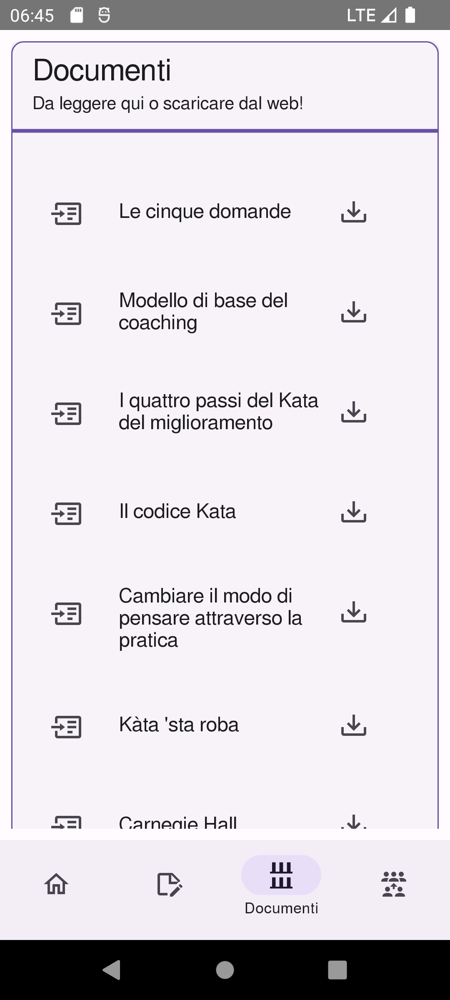
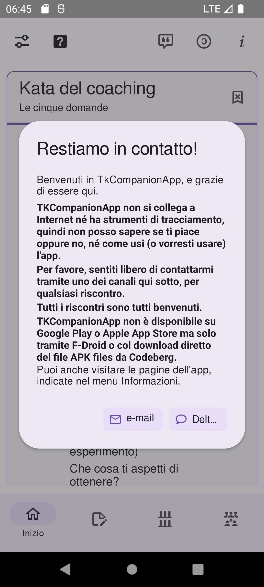

<!--
© 2021-2022 Marco Bresciani

Copying and distribution of this file, with or without modification,
are permitted in any medium without royalty provided the copyright
notice and this notice are preserved.
This file is offered as-is, without any warranty.

SPDX-FileCopyrightText: 2021-2022 Marco Bresciani

SPDX-License-Identifier: FSFAP
-->
# TKCompanionApp


[](https://api.reuse.software/info/github.com/marcoXbresciani/TKCompanionApp)


[](https://semver.org/)
[](https://github.com/RichardLitt/standard-readme)
[](https://bestpractices.coreinfrastructure.org/projects/6084)
[](https://internal.repos.regiongold.com/bitbucket/projects/GDP/repos/customer-sdk/browse/.editorconfig)
[](https://hosted.weblate.org/engage/tkcompanionapp/)
[](https://github.github.com/gfm/)

[](https://blog.codinghorror.com/the-works-on-my-machine-certification-program/)
<a href="https://liberapay.com/marcoXbresciani/donate"></a>


Un piccolo e semplice aiuto per i praticanti di Toyota Kata

Contiene la carta Coaching Kata 5Q, e (forse) altre cose e informazioni.
Contenuti da migliorare e aggiornare di volta in volta.
L'obiettivo di quest'app è di diventare un pratico vademecum/manuale per
le persone interessate ad applicare il metodo scientifico tramite Toyota
Kata.

## Sommario
1. [Sicurezza](#sicurezza)
1. [Contesto](#contesto)
1. [Installazione](#installazione)
1. [Uso](#uso)
   1. [Legenda](#legenda)
      1. [Icone](#icone)
   1. [Schermate](#schermate)
   1. [Note sui font](#note-sui-font)
1. [Manutentori](#manutentori)
   1. [Traduzioni](#traduzioni)
1. [Ringraziamenti](#ringraziamenti)
1. [Contribuire](#contribuire)
1. [Licenza](#licenza)

## Sicurezza
Vedere il file [SECURITY.md](/docs/SECURITY.md) per note e aggiornamenti
riguardanti problemi di sicurezza.

## Contesto
Dal sito web
[the Toyota Kata website](http://www-personal.umich.edu/~mrother/Homepage.html):
> Toyota Kata is a way for managers and educators to initiate and coach
> practice of practical scientific-thinking skills in their teams, to
> develop and mobilize creative capability.
> Competitive conditions favor teams and organizations that know how to
> adapt.
> It's not as difficult as you might think, because you can begin by
> practicing a set of simple "Starter Kata."
>
> Toyota Kata is about starter practice routines for developing
> scientific thinking.
> From there each individual & team can develop their own way.
>
> Toyota Kata is a skill-building process that shifts you and your team
> from a natural tendency to jump to conclusions ... to thinking,
> working and reacting more scientifically.
> Best of all, you only need to practice 20 minutes a day, under the
> guidance of your coach.

## Installazione
Questa app è creata usando React Native per fare in modo che l'app per
Android e iOS sia generata più facilmente dallo stesso codice sorgente.

Purtroppo, pubblicare l'app su Google Play Store o su Apple App Store,
richiede soldi che non voglio spendere: è
[una tantum $25](https://support.google.com/googleplay/android-developer/answer/6112435?hl=it&ref_topic=3450769#zippy=%2Cstep-pay-registration-fee)
per un account sviluppatore Google, ed è pari a
[$99/anno](https://developer.apple.com/support/enrollment/) (!) per il
Programma per Sviluppatori Apple.

Quindi, per ora, questa app si trova solo su
[F-Droid](https://f-droid.org/), il _catalogo installabile di FOSS
(Software libero e open source) per la piattaforma Android_.

[](https://f-droid.org/packages/name.bresciani.marco.tkcompanionapp)

Per installare questa app, è necessaria l'app client F-Droid (molto
simile a Google Play Store o Apple App Store) dal
[sito principale](https://www.f-droid.org/): c'è un QR Code facile da
usare per scaricarla e
[installarla](https://en.wikipedia.org/wiki/F-Droid#Client_application).

Quindi, aprendo l'app F-Droid si può cercare
[TKCompanionApp](https://f-droid.org/en/packages/name.bresciani.marco.tkcompanionapp/).
Installarla e aprirla.

In alternativa, dalla
[pagina dell'applicazione su sito F-Droid](https://f-droid.org/en/packages/name.bresciani.marco.tkcompanionapp/),
si può scaricare direttamente il file APK da installare manualmente sul
proprio dispositivo.
Non c'è nessuna differenza nelle funzionalità, l'unica differenza è che,
in questo modo, non ci sarà l'app client F-Droid a garantire gli
aggiornamenti automatici (un po' come fa Google Play colle altre app).

Benvenuti nel mondo FOSS.
Si può dare anche un'occhiata a tutte le altre meravigliose app FOSS che
si trovano in F-Droid.

## Uso
Beh, è facile: installa l'app, apri l'app, fai clic su alcuni pulsanti.
Non ci sono giochi, nessun quiz, nessuna azione da intraprendere (per
ora).
Siediti, segui il menu, impara, esercitati e migliora.

### Legenda

#### Icone
* 
  questa icona indica che l'app aprirà una pagina web all'esterno
  dell'app stessa, usando qualsivoglia browser o app che hai configurato
  sul dispositivo per navigare in Internet, e mostrerà una pagina web
  esterna.
* 
  questa icona indica che l'app scaricherà un file specifico (dal sito
  Toyota Kata, se non specificato altrimenti).
  Il modo in cui il dispositivo gestirà il file dipenderà dalla
  configurazione del dispositivo stesso.
  Il testo associato all'icona di download indicherà sempre il tipo di
  file che sarà scaricato.

### Schermate




### Note sui font
* Il font usato è [Free
  Sans](https://www.gnu.org/software/freefont/index.html)
* Le dimensioni dei caratteri sono derivate da [GRT
  Calculator](https://grtcalculator.com) usando 20px come dimensione di
  riferimento per font [Open Sans](https://mattesontypographics.com/).
  Le misure sono:
  * piccolo: 16px, 28px altezza della linea
  * normale: 20px, 34px altezza della linea
  * grande: 25px, 41px altezza della linea

## Manutentori
L'app è stata iniziata da Marco Bresciani ed è attualmente mantenuta da
Marco Bresciani.
Lo stesso per questo documento.

È possibile contattare l'autore tramite:
* [Delta Chat](https://delta.chat/en/) con l'indirizzo di posta
  elettronica [marco.530@outlook.it](mailto:marco.530@outlook.it).
* Come <a rel="me" href="https://fosstodon.org/@AAMfP">@AAMfP</a>, su
  [Fosstodon](https://fosstodon.org), un'istanza di
  [Mastodon](https://joinmastodon.org/).
* [Briar](https://briarproject.org/), con il link
  ```text
  briar://advt45wcki7nmxhnb25sezrohkiistjq7qqjjeyo7njsdwflymydm
  ```
  da copiare e aggiungere come "contatto distante" in Briar.

### Traduzioni
* [Allan Nordhøy (@comradekingu)](https://github.com/comradekingu) per
  la traduzione in norvegese Bokmål.
* [J. Lavoie (@Edanas)](https://hosted.weblate.org/user/Edanas/) per la
  traduzione in francese.
* [Amy Dora Lang (@amydoralang)](https://hosted.weblate.org/user/amydoralang/)
  per la traduzione in tedesco.

## Ringraziamenti
Grazie a (in ordine di apparizione):
* [Marco Montalbano (@marcomontalbano)](https://github.com/marconontalbano)
  perché senza i suoi insegnamenti quest'app non sarebbe mai esistita.
* [@licaon-kter](https://github.com/licaon-kter) per il supporto nella
  pubblicazione dell'app su F-Droid.
* [Mike Rother](http://www-personal.umich.edu/~mrother/Homepage.html)
  per l'icona dell'app.

## Contribuire
Cfr. [CONTRIBUTING.it.md](/docs/CONTRIBUTING.it.md).

Per contribuire colle traduzioni nella tua lingua madre, puoi vedere
[Weblate](https://hosted.weblate.org/engage/tkcompanionapp/), la
piattaforma scelta per gestire le traduzioni multi-lingua.

> Puoi contribure anche tramite Liberapay:
>
> <a href="https://liberapay.com/marcoXbresciani/donate"></a>
>
> 
> 

## Licenza
Vedere la cartella `LICENSES` o il file `COPYING` per i testi integrali
delle licenze.

Licenza generale del progetto, in breve:
[](https://www.gnu.org/licenses/gpl-3.0.html)
```text
© 2021-2022 Marco Bresciani
This file is part of TKCompanionApp.

TKCompanionApp is free software: you can redistribute it and/or modify
it under the terms of the GNU General Public License as published by the
Free Software Foundation, either version 3 of the License, or (at your
option) any later version.

TKCompanionApp is distributed in the hope that it will be useful, but
WITHOUT ANY WARRANTY; without even the implied warranty of
MERCHANTABILITY or FITNESS FOR A PARTICULAR PURPOSE. See the GNU General
Public License for more details.

You should have received a copy of the GNU General Public License along
with TKCompanionApp. If not, see <https://www.gnu.org/licenses/>.
```

Licenza di questo documento, in breve:
[](https://www.gnu.org/prep/maintain/html_node/License-Notices-for-Other-Files.html)
```text
© 2021-2022 Marco Bresciani

Copying and distribution of this file, with or without modification,
are permitted in any medium without royalty provided the copyright
notice and this notice are preserved.
This file is offered as-is, without any warranty.
```

> []()
> Questa è una opera liberamente licenziata, come spiegato nella
> [Definizione di Opere Culturali Libere](https://freedomdefined.org/Definition).

[Free Sans](https://www.gnu.org/software/freefont/index.html) è il font
usato, licenziato [under the terms of the GNU General Public
License](https://www.gnu.org/software/freefont/license.html).
