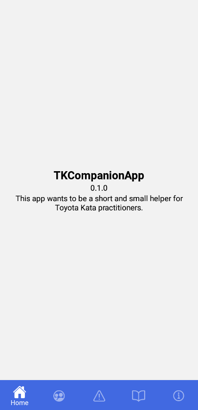
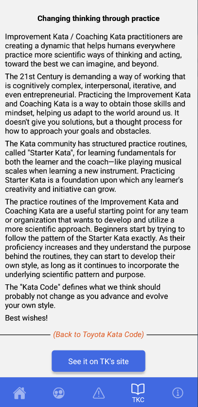
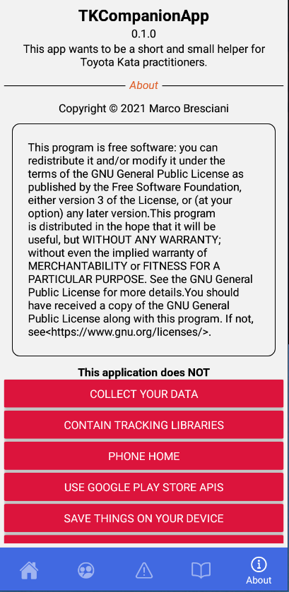

<!--
© 2021-2022 Marco Bresciani

Copying and distribution of this file, with or without modification,
are permitted in any medium without royalty provided the copyright
notice and this notice are preserved.
This file is offered as-is, without any warranty.

SPDX-FileCopyrightText: 2021-2022 Marco Bresciani

SPDX-License-Identifier: FSFAP
-->
# TKCompanionApp


[](https://api.reuse.software/info/github.com/marcoXbresciani/TKCompanionApp)
[](https://semver.org/)
[](https://github.com/RichardLitt/standard-readme)
[](https://confluence.atlassian.com/bitbucketserver/markdown-syntax-guide-776639995.html)
[](https://blog.codinghorror.com/the-works-on-my-machine-certification-program/)

This app wants to be a short and small helper for Toyota Kata
practitioners.

It will contain the Coaching Kata 5Q card, plus (possibly) more things
and information.
This is my very first experiment with React Native.
If it'll ever work.

## Table of Contents
1. [Background](#background)
1. [Install](#install)
1. [Usage](#usage)
1. [Maintainers](#maintainers)
1. [Contributing](#contributing)
    1. [How to Start](#how-to-start)
1. [License](#license)

## Background
From the Toyota Kata website:
> Toyota Kata is a way for managers and educators to initiate and coach
> practice of practical scientific-thinking skills in their teams, to
> develop and mobilize creative capability.
> Competitive conditions favor teams and organizations that know how to
> adapt.
> It's not as difficult as you might think, because you can begin by
> practicing a set of simple "Starter Kata."
>
> Toyota Kata is about starter practice routines for developing
> scientific thinking.
> From there each individual & team can develop their own way.
>
> Toyota Kata is a skill-building process that shifts you and your team
> from a natural tendency to jump to conclusions ... to thinking,
> working and reacting more scientifically.
> Best of all, you only need to practice 20 minutes a day, under the
> guidance of your coach.

## Install
This app is currently built using React Native, through Expo framework,
to make easier building the app for both Android and iOS from the same
source code.

Unfortunately, publishing the app on Google Play Store or on Apple App
Store, requires money I don't have and don't want to spend: it's
[one-time $25](https://support.google.com/googleplay/android-developer/answer/6112435?hl=en&ref_topic=3450769#zippy=%2Cstep-pay-registration-fee)
for a Google Developer Account, and it's even
[$99/year](https://developer.apple.com/support/enrollment/) for the
Apple Developer Program.

So, for now, you'll find this app only through the _F-Droid_ Free and
Open Source Android App Repository.

To install the app, you then need the F-Droid store app from the main
site https://www.f-droid.org/ (you can find an easy QR Code to download
it).
Or you can download it from the Google Play Store (but why you should?).

Then, open the F-Droid repository app and search for _TKCompanionApp_.
Install it, and open it.

## Usage

### Screenshots




## Maintainers
The app has been started by Marco Bresciani and is currently maintained
by Marco Bresciani.
Same for this document.

## Contributing
Find latest current LTS NodeJS
([16.13.1](https://nodejs.org/download/release/latest-gallium/), as of
2022-01-05) for your system.
Then go to this project main folder (also containing this same file
you're reading) and run `npm -g install yarn`.
This done, run `yarn install` and you should see all the needed
dependencies downloaded and installed through Yarn package manager.

### How to start
From command line launch `yarn start` (or `expo start --dev-client`, but
why making your life worse?) that will run Metro tool (don't know what
it actually is, but seems something needed).

From (another) command line launch `yarn android` (or, again, make your
life pitier and use `expo run:android`) that will prepare and launch
your app, connecting to the Metro thing above.

### How to build
Once you should have used `expo build:android`, but it has been now
superseded by `eas build`.
So, install `eas-cli` with the command `npm install -g eas-cli` and run
the following `eas build -p android` to (possibly) have fun.
Maybe.

## License
This document license, in brief:
[](https://www.gnu.org/prep/maintain/html_node/License-Notices-for-Other-Files.html)
```text
© 2021-2022 Marco Bresciani

Copying and distribution of this file, with or without modification,
are permitted in any medium without royalty provided the copyright
notice and this notice are preserved.
This file is offered as-is, without any warranty.
```

> []()
This is a freely licensed work, as explained in the [Definition of Free Cultural Works](https://freedomdefined.org/Definition).

Overall project license, in brief:
[](https://www.gnu.org/licenses/gpl-3.0.html)
```text
© 2021-2022 Marco Bresciani
This file is part of TKCompanionApp.

TKCompanionApp is free software: you can redistribute it and/or modify
it under the terms of the GNU General Public License as published by the
Free Software Foundation, either version 3 of the License, or (at your
option) any later version.

TKCompanionApp is distributed in the hope that it will be useful, but
WITHOUT ANY WARRANTY; without even the implied warranty of
MERCHANTABILITY or FITNESS FOR A PARTICULAR PURPOSE. See the GNU General
Public License for more details.

You should have received a copy of the GNU General Public License along
with TKCompanionApp. If not, see <https://www.gnu.org/licenses/>.
```
See `LICENSES` folder or `COPYING` file, for the whole license text.
