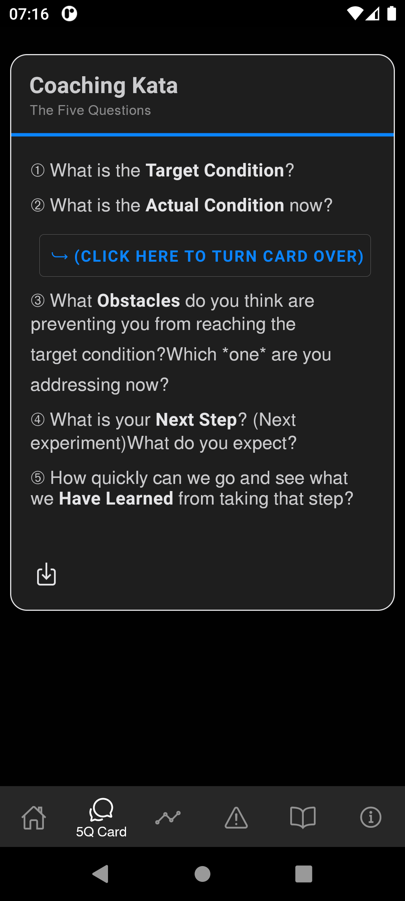
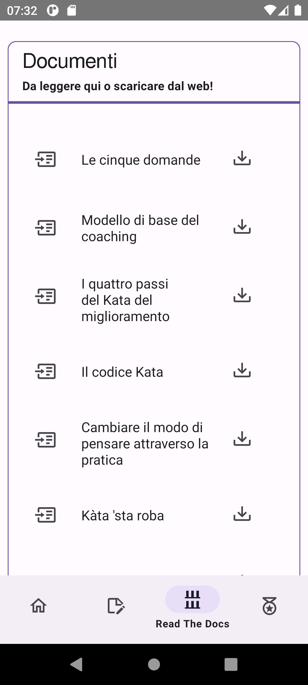
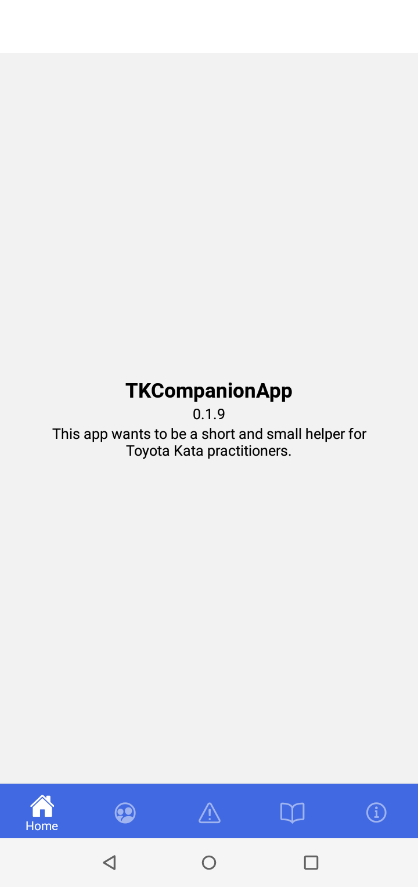

<!--
© 2021-2022 Marco Bresciani

Copying and distribution of this file, with or without modification,
are permitted in any medium without royalty provided the copyright
notice and this notice are preserved.
This file is offered as-is, without any warranty.

SPDX-FileCopyrightText: 2021-2022 Marco Bresciani

SPDX-License-Identifier: FSFAP
-->
# TKCompanionApp


[](https://api.reuse.software/info/github.com/marcoXbresciani/TKCompanionApp)


[](https://semver.org/)
[](https://github.com/RichardLitt/standard-readme)
[](https://github.github.com/gfm/)

[](https://blog.codinghorror.com/the-works-on-my-machine-certification-program/)
<a href="https://liberapay.com/marcoXbresciani/donate"></a>


A short and small helper for Toyota Kata practitioners

It contains the Coaching Kata 5Q card, plus (possibly) more things
and information.
Content to be improved and updated from time to time.

## Table of Contents
1. [Background](#background)
1. [Install](#install)
1. [Usage](#usage)
   1. [Legend](#legend)
      1. [Icons](#icons)
   1. [Screenshots](#screenshots)
1. [Font Notes](#font-notes)
1. [Maintainers](#maintainers)
1. [Thanks](#thanks)
1. [Contributing](#contributing)
1. [License](#license)

## Background
From the Toyota Kata website:
> Toyota Kata is a way for managers and educators to initiate and coach
> practice of practical scientific-thinking skills in their teams, to
> develop and mobilize creative capability.
> Competitive conditions favor teams and organizations that know how to
> adapt.
> It's not as difficult as you might think, because you can begin by
> practicing a set of simple "Starter Kata."
>
> Toyota Kata is about starter practice routines for developing
> scientific thinking.
> From there each individual & team can develop their own way.
>
> Toyota Kata is a skill-building process that shifts you and your team
> from a natural tendency to jump to conclusions ... to thinking,
> working and reacting more scientifically.
> Best of all, you only need to practice 20 minutes a day, under the
> guidance of your coach.

## Install
[](https://f-droid.org/packages/name.bresciani.marco.tkcompanionapp)

This app is currently built using React Native to make building the app
for both Android and iOS from the same source code easier.

Unfortunately, publishing the app on Google Play Store or on Apple App
Store, requires money I don't want to spend: it's
[one-time $25](https://support.google.com/googleplay/android-developer/answer/6112435?hl=en&ref_topic=3450769#zippy=%2Cstep-pay-registration-fee)
for a Google Developer Account, and it's even
[$99/year](https://developer.apple.com/support/enrollment/) (!) for the
Apple Developer Program.

So, for now, you can find this app only through the
[F-Droid](https://f-droid.org/) _installable catalogue of FOSS (Free and
Open Source Software) applications for the Android platform_.

To install this app, you then need the F-Droid client app (pretty
similar to Google Play Store or Apple App Store) from the
[main site](https://www.f-droid.org/): there's an easy QR Code to
download and
[install it](https://en.wikipedia.org/wiki/F-Droid#Client_application).

Then, open the F-Droid repository app and search for
[TKCompanionApp](https://f-droid.org/en/packages/name.bresciani.marco.tkcompanionapp/).
Install it, and open it.

Welcome to the world of FOSS.
Please also take a look at all other wonderful FOSS apps you can find in
F-Droid.

## Usage
Well, it's easy: install the app, open the app, click some buttons.
There are no games, no quizzes, no actions to take.
Just sit, follow the menu, learn, practice and improve.

### Legend

#### Icons
* 
  this icon means that the app will open a web page outside the app
  itself, using whatever browser or app you have configured on your
  device to browse the Internet and show you an external web page.
* 
  this icon means that the app will download a specific file (from The
  Toyota Kata Website, if not otherwise specified).
  The way your device will manage such file will depend on the device
  configuration.
  The text associated to the download icon will always specify the type
  of file that will be downloaded.

### Screenshots




## Font Notes
* Font used is [Free
  Sans](https://www.gnu.org/software/freefont/index.html).
* Font sizes are derived from [GRT
  Calculator](https://grtcalculator.com) using 20px as base/default font
  size for [Open Sans](https://mattesontypographics.com/) font.
  Sizes are:
  * smaller: 16px, 28px line height,
  * default: 20px, 34px line height,
  * bigger: 25px, 41px line height.

## Maintainers
The app has been started by Marco Bresciani and is currently maintained
by Marco Bresciani.
Same for this document.

You can find me on
<a rel="me" href="https://fosstodon.org/@AAMfP">Fosstodon</a>, a
Mastodon instance.

You can keep in touch with the author through
[Delta Chat](https://delta.chat/en/) with the email address
[marco.530@outlook.it](mailto:marco.530@outlook.it).

You can keep in touch with the author also through
[Briar](https://briarproject.org/) with the link
```text
briar://advt45wcki7nmxhnb25sezrohkiistjq7qqjjeyo7njsdwflymydm
```
to be copy-pasted as "contact at a distance" in Briar.

## Thanks
Thanks to:
* [Marco Montalbano @marcomontalbano](https://github.com/marcomontalbano) because without his teachings, this app would never had happened.
* [@licaon-kter](https://github.com/licaon-kter) for the support on
  publishing the app to F-Droid.
* [Mike Rother](http://www-personal.umich.edu/~mrother/Homepage.html)
  for the app icon.

## Contributing
<a href="https://liberapay.com/marcoXbresciani/donate"></a>

See [CONTRIBUTING.md](/docs/CONTRIBUTING.md).

## License
Overall project license, in brief:
[](https://www.gnu.org/licenses/gpl-3.0.html)
```text
© 2021-2022 Marco Bresciani
This file is part of TKCompanionApp.

TKCompanionApp is free software: you can redistribute it and/or modify
it under the terms of the GNU General Public License as published by the
Free Software Foundation, either version 3 of the License, or (at your
option) any later version.

TKCompanionApp is distributed in the hope that it will be useful, but
WITHOUT ANY WARRANTY; without even the implied warranty of
MERCHANTABILITY or FITNESS FOR A PARTICULAR PURPOSE. See the GNU General
Public License for more details.

You should have received a copy of the GNU General Public License along
with TKCompanionApp. If not, see <https://www.gnu.org/licenses/>.
```

This document license, in brief:
[](https://www.gnu.org/prep/maintain/html_node/License-Notices-for-Other-Files.html)
```text
© 2021-2022 Marco Bresciani

Copying and distribution of this file, with or without modification,
are permitted in any medium without royalty provided the copyright
notice and this notice are preserved.
This file is offered as-is, without any warranty.
```

> []()
This is a freely licensed work, as explained in the [Definition of Free Cultural Works](https://freedomdefined.org/Definition).

See `LICENSES` folder or `COPYING` file, for the whole licences text.

[Free Sans](https://www.gnu.org/software/freefont/index.html) is the
used font, and it's licensed [under the terms of the GNU General Public
License](https://www.gnu.org/software/freefont/license.html).
