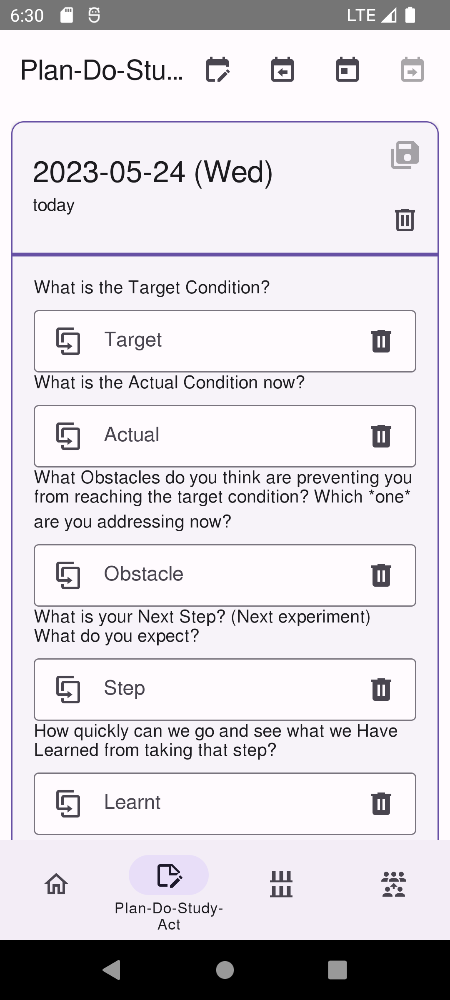
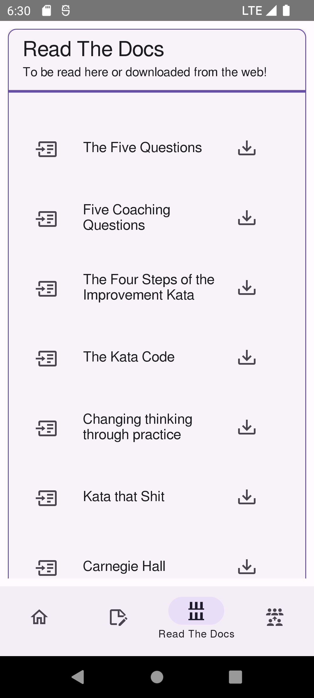
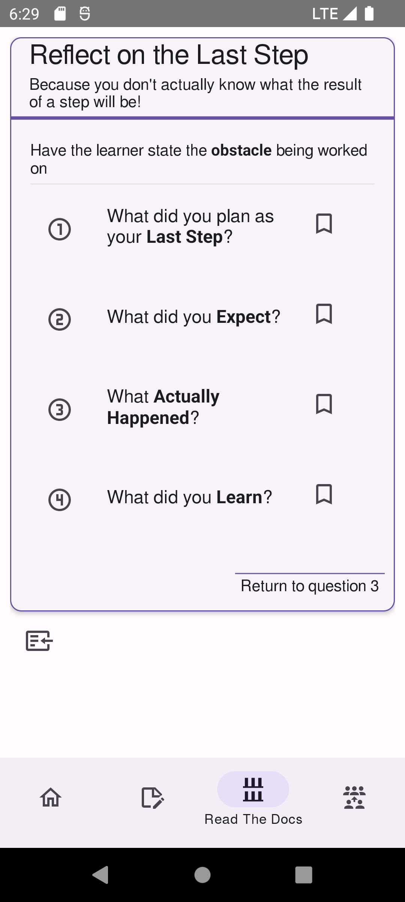
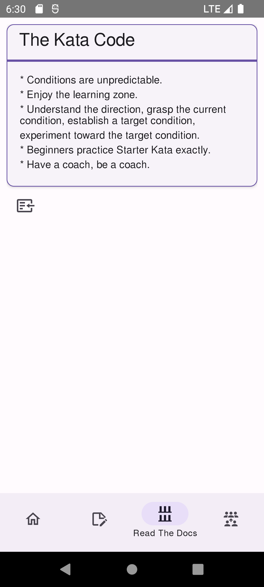

<!--
© 2021-2023 Marco Bresciani

Copying and distribution of this file, with or without modification,
are permitted in any medium without royalty provided the copyright
notice and this notice are preserved.
This file is offered as-is, without any warranty.

SPDX-FileCopyrightText: 2021-2023 Marco Bresciani

SPDX-License-Identifier: FSFAP
-->
# TKCompanionApp

[](https://codeberg.org/marco.bresciani/TKCompanionApp/src/branch/master/COPYING)
[](https://codeberg.org/marco.bresciani/TKCompanionApp/)
[](https://codeberg.org/marco.bresciani/TKCompanionApp/src/tag/6.1.1)

[](https://f-droid.org/en/packages/name.bresciani.marco.tkcompanionapp/)
[](https://github.com/standard/ts-standard)
[](https://api.reuse.software/info/github.com/marcoXbresciani/TKCompanionApp)
![Keep a Changelog](https://img.shields.io/badge/Keep%20a%20Changelog--555.svg?logo=data%3Aimage%2Fsvg%2Bxml%3Bbase64%2CPHN2ZyB4bWxucz0iaHR0cDovL3d3dy53My5vcmcvMjAwMC9zdmciIGZpbGw9IiNmMTVkMzAiIHZpZXdCb3g9IjAgMCAxODcgMTg1Ij48cGF0aCBkPSJNNjIgN2MtMTUgMy0yOCAxMC0zNyAyMmExMjIgMTIyIDAgMDAtMTggOTEgNzQgNzQgMCAwMDE2IDM4YzYgOSAxNCAxNSAyNCAxOGE4OSA4OSAwIDAwMjQgNCA0NSA0NSAwIDAwNiAwbDMtMSAxMy0xYTE1OCAxNTggMCAwMDU1LTE3IDYzIDYzIDAgMDAzNS01MiAzNCAzNCAwIDAwLTEtNWMtMy0xOC05LTMzLTE5LTQ3LTEyLTE3LTI0LTI4LTM4LTM3QTg1IDg1IDAgMDA2MiA3em0zMCA4YzIwIDQgMzggMTQgNTMgMzEgMTcgMTggMjYgMzcgMjkgNTh2MTJjLTMgMTctMTMgMzAtMjggMzhhMTU1IDE1NSAwIDAxLTUzIDE2bC0xMyAyaC0xYTUxIDUxIDAgMDEtMTItMWwtMTctMmMtMTMtNC0yMy0xMi0yOS0yNy01LTEyLTgtMjQtOC0zOWExMzMgMTMzIDAgMDE4LTUwYzUtMTMgMTEtMjYgMjYtMzMgMTQtNyAyOS05IDQ1LTV6TTQwIDQ1YTk0IDk0IDAgMDAtMTcgNTQgNzUgNzUgMCAwMDYgMzJjOCAxOSAyMiAzMSA0MiAzMiAyMSAyIDQxLTIgNjAtMTRhNjAgNjAgMCAwMDIxLTE5IDUzIDUzIDAgMDA5LTI5YzAtMTYtOC0zMy0yMy01MWE0NyA0NyAwIDAwLTUtNWMtMjMtMjAtNDUtMjYtNjctMTgtMTIgNC0yMCA5LTI2IDE4em0xMDggNzZhNTAgNTAgMCAwMS0yMSAyMmMtMTcgOS0zMiAxMy00OCAxMy0xMSAwLTIxLTMtMzAtOS01LTMtOS05LTEzLTE2YTgxIDgxIDAgMDEtNi0zMiA5NCA5NCAwIDAxOC0zNSA5MCA5MCAwIDAxNi0xMmwxLTJjNS05IDEzLTEzIDIzLTE2IDE2LTUgMzItMyA1MCA5IDEzIDggMjMgMjAgMzAgMzYgNyAxNSA3IDI5IDAgNDJ6bS00My03M2MtMTctOC0zMy02LTQ2IDUtMTAgOC0xNiAyMC0xOSAzN2E1NCA1NCAwIDAwNSAzNGM3IDE1IDIwIDIzIDM3IDIyIDIyLTEgMzgtOSA0OC0yNGE0MSA0MSAwIDAwOC0yNCA0MyA0MyAwIDAwLTEtMTJjLTYtMTgtMTYtMzEtMzItMzh6bS0yMyA5MWgtMWMtNyAwLTE0LTItMjEtN2EyNyAyNyAwIDAxLTEwLTEzIDU3IDU3IDAgMDEtNC0yMCA2MyA2MyAwIDAxNi0yNWM1LTEyIDEyLTE5IDI0LTIxIDktMyAxOC0yIDI3IDIgMTQgNiAyMyAxOCAyNyAzM3MtMiAzMS0xNiA0MGMtMTEgOC0yMSAxMS0zMiAxMXptMS0zNHYxNGgtOFY2OGg4djI4bDEwLTEwaDExbC0xNCAxNSAxNyAxOEg5NnoiLz48L3N2Zz4K)
[](https://github.com/RichardLitt/standard-readme)
[](https://bestpractices.coreinfrastructure.org/projects/6084)
[](https://codeberg.org/marco.bresciani/TKCompanionApp/commits/branch/master)
[](https://semver.org/)
[](https://internal.repos.regiongold.com/bitbucket/projects/GDP/repos/customer-sdk/browse/.editorconfig)
[](https://github.github.com/gfm/)
[](https://hosted.weblate.org/engage/tkcompanionapp/)

[](https://blog.codinghorror.com/the-works-on-my-machine-certification-program/)
<a href="https://liberapay.com/marcoXbresciani/donate"></a>


A short and small helper for Toyota Kata practitioners

Goal of this app is to be a practical vademecum/handbook for those
interested in applying scientific thinking through Toyota Kata.
It contains the Coaching Kata 5Q card, plus (possibly) more things
and information.
Content to be improved and updated from time to time.

## Table of Contents

1. [Security](#security)
1. [Background](#background)
1. [Install](#install)
1. [Usage](#usage)
   1. [Screenshots](#screenshots)
   1. [Font Notes](#font-notes)
1. [Maintainers](#maintainers)
   1. [Translations](#translations)
1. [Thanks](#thanks)
1. [Contributing](#contributing)
1. [License](#license)

## Security

> **DO NOT** download TKCompanionApp from Google Play!!!

**Alert**:

> Please note that TKCompanionApp is currently **not** on Google Play
> and won't be there in the near future.
>
> There already was a case of an unwanted, ads-filled clone/copycat of
> TKCompanionApp on Google Play.
>
> If you have downloaded TKCompanionApp from Google Play or Apple Play
> Store please, for your safety, remove it and install it only from
> F-Droid or from APK files available on the Codeberg repository.

See file [SECURITY.md](/docs/SECURITY.md) for notes and updates related
to security issues.

## Background

From [the Toyota Kata website](http://www-personal.umich.edu/~mrother/Homepage.html):
> Toyota Kata is a way for managers and educators to initiate and coach
> practice of practical scientific-thinking skills in their teams, to
> develop and mobilize creative capability.
> Competitive conditions favor teams and organizations that know how to
> adapt.
> It's not as difficult as you might think, because you can begin by
> practicing a set of simple "Starter Kata."
>
> Toyota Kata is about starter practice routines for developing
> scientific thinking.
> From there each individual & team can develop their own way.
>
> Toyota Kata is a skill-building process that shifts you and your team
> from a natural tendency to jump to conclusions ... to thinking,
> working and reacting more scientifically.
> Best of all, you only need to practice 20 minutes a day, under the
> guidance of your coach.

## Install

This app is currently built using React Native to make building the app
for both Android and iOS from the same source code easier.

Unfortunately, publishing the app on Google Play Store or on Apple App
Store, requires money I don't want to spend: it's
[one-time $25](https://support.google.com/googleplay/android-developer/answer/6112435?hl=en&ref_topic=3450769#zippy=%2Cstep-pay-registration-fee)
for a Google Developer Account, and it's even
[$99/year](https://developer.apple.com/support/enrollment/) (!) for the
Apple Developer Program.

> If you found it, **DO NOT** download TKCompanionApp from Google Play
> or Apple App Store: it's not the real one available from F-Droid or
> Codeberg!

So (for now) you can find this app *only* through the
[F-Droid](https://f-droid.org/) *installable catalogue of FOSS (Free and
Open Source Software) applications for the Android platform*.

[](https://f-droid.org/packages/name.bresciani.marco.tkcompanionapp)

To install this app, you then need the F-Droid client app (pretty
similar to Google Play Store or Apple App Store) from the
[main site](https://www.f-droid.org/): there's an easy QR Code to
download and
[install it](https://en.wikipedia.org/wiki/F-Droid#Client_application).

Then, open the F-Droid repository app and search for
[TKCompanionApp](https://f-droid.org/en/packages/name.bresciani.marco.tkcompanionapp/).
Install it, and open it.

Eventually, you can directly download the APK from the
[app page on F-Droid website](https://f-droid.org/en/packages/name.bresciani.marco.tkcompanionapp/),
to be installed manually on your device.
There's no difference in functionalities, the only difference being the
fact that without the F-Droid client app you won't receive automatic
updates (just like Google Play did with other apps).

Welcome to the world of FOSS.
Please also take a look at all other wonderful FOSS apps you can find in
F-Droid.

## Usage

Well, it's easy: install the app, open the app, click some buttons.
There are no games, no quizzes, no actions to take (yet).
Just sit, follow the menu, learn, practice and improve.

### Screenshots

* Home Page
  
* About Dialog
  
* PDSA Journal Page
  
* Documents Page
  
* 5Q Card
  
* The Kata Code
  

### Font Notes

* Font used is [Free
  Sans](https://www.gnu.org/software/freefont/index.html).

## Maintainers

The app has been started by Marco Bresciani and is currently maintained
by Marco Bresciani.
Same for this document.

You can keep in touch with the author through:

* [Delta Chat](https://delta.chat/en/) with the email address
  [marco.530@outlook.it](mailto:marco.530@outlook.it).
* as <a rel="me" href="https://fosstodon.org/@AAMfP">@AAMfP</a> on
  [Fosstodon](https://fosstodon.org), a
  [Mastodon](https://joinmastodon.org/) instance.

### Translations

Current (and past) contributors:
[](https://hosted.weblate.org/engage/tkcompanionapp/)

* [](https://hosted.weblate.org/engage/tkcompanionapp/de/)
  [Amy Dora Lang (@amydoralang)](https://hosted.weblate.org/user/amydoralang/)
  for the German translation.
* [](https://hosted.weblate.org/engage/tkcompanionapp/en/)
  [Marco Bresciani (@marcoXbresciani)](https://codeberg.org/marco.bresciani)
  for the English version.
* [](https://hosted.weblate.org/engage/tkcompanionapp/fr/)
  [J. Lavoie (@Edanas)](https://hosted.weblate.org/user/Edanas/) for the
  French translation.
* [](https://hosted.weblate.org/engage/tkcompanionapp/it-IT/)
  [Marco Bresciani (@marcoXbresciani)](https://codeberg.org/marco.bresciani)
  for the Italian version.
* [](https://hosted.weblate.org/engage/tkcompanionapp/nb_NO/)
  [Allan Nordhøy (@comradekingu)](https://github.com/comradekingu) for
  the Norwegian Bokmål translation.

## Thanks

Thanks to (in appearing order):

* [Marco Montalbano (@marcomontalbano)](https://github.com/marcomontalbano)
  because without his teachings, this app would never have happened.
* [@licaon-kter](https://github.com/licaon-kter) for the support on
  publishing the app to F-Droid.
* [Mike Rother](http://www-personal.umich.edu/~mrother/Homepage.html)
  for the app icon.
* [Gant Laborde (@GantMan)](https://github.com/GantMan) for mentioning
  TKCompanionApp in his
  [React Native Apps](https://github.com/ReactNativeNews/React-Native-Apps)
  Curated List of Open Source React Native Apps.
* [@mondstern@mastodon.green](https://mastodon.green/@mondstern) for
  mentioning TKCompanionApp in the
  [we ❤️ @Codeberg](https://welove.codeberg.page/) list of F-Droid apps
  hosted on Codeberg.

## Contributing

See [CONTRIBUTING.md](/docs/CONTRIBUTING.md).

For contributing with translations in your own native language, you can
see [Weblate](https://hosted.weblate.org/engage/tkcompanionapp/), that
is the choosen platform for managing translations in multiple languages.

> You can even contribute through Liberapay:
>
> <a href="https://liberapay.com/marcoXbresciani/donate"></a>
>
> 
> 

## License

See `LICENSES` folder or `COPYING` file, for the whole licences text.

Overall project license, in brief:
[](https://www.gnu.org/licenses/gpl-3.0.html)

```text
© 2021-2023 Marco Bresciani
This file is part of TKCompanionApp.

TKCompanionApp is free software: you can redistribute it and/or modify
it under the terms of the GNU General Public License as published by the
Free Software Foundation, either version 3 of the License, or (at your
option) any later version.

TKCompanionApp is distributed in the hope that it will be useful, but
WITHOUT ANY WARRANTY; without even the implied warranty of
MERCHANTABILITY or FITNESS FOR A PARTICULAR PURPOSE. See the GNU General
Public License for more details.

You should have received a copy of the GNU General Public License along
with TKCompanionApp. If not, see <https://www.gnu.org/licenses/>.
```

This document license, in brief:
[](https://www.gnu.org/prep/maintain/html_node/License-Notices-for-Other-Files.html)

```text
© 2021-2023 Marco Bresciani

Copying and distribution of this file, with or without modification,
are permitted in any medium without royalty provided the copyright
notice and this notice are preserved.
This file is offered as-is, without any warranty.
```

> 
This is a freely licensed work, as explained in the [Definition of Free Cultural Works](https://freedomdefined.org/Definition).

[Free Sans](https://www.gnu.org/software/freefont/index.html) is the
used font, and it's licensed [under the terms of the GNU General Public
License](https://www.gnu.org/software/freefont/license.html).
